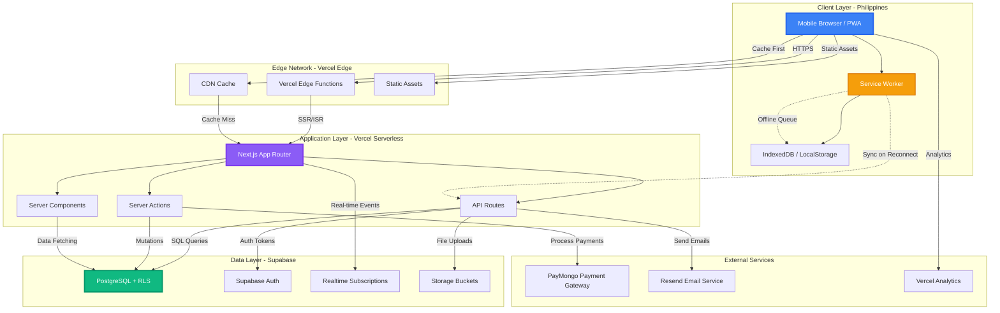
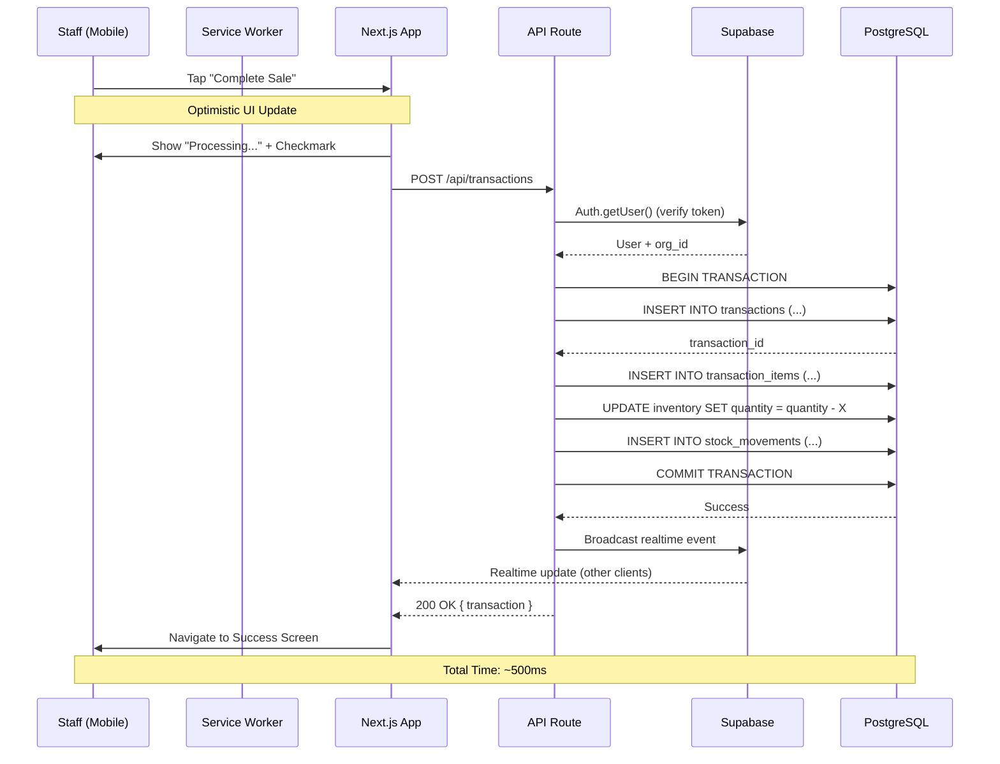

# Architecture Document
## VapeTrack PH - Technical Strategy & System Design

**Version:** 1.0  
**Last Updated:** February 4, 2026  
**Author:** Technical Lead - VapeTrack PH  
**Target Audience:** Development Team, Technical Stakeholders

---

## 📋 Table of Contents
- [Executive Summary](#executive-summary)
- [High-Level Architecture](#high-level-architecture)
- [Technology Stack](#technology-stack)
- [Key Technical Decisions](#key-technical-decisions)
- [Multi-Tenancy Implementation](#multi-tenancy-implementation)
- [Performance Optimization](#performance-optimization)
- [Security Architecture](#security-architecture)
- [Deployment Strategy](#deployment-strategy)
- [Project Structure](#project-structure)
- [Development Workflow](#development-workflow)
- [Monitoring & Observability](#monitoring--observability)
- [Future Scalability](#future-scalability)

---

## Executive Summary

VapeTrack PH is a **Progressive Web App (PWA)** built with a modern, serverless architecture optimized for the **Philippine market**. The system is designed to:

✅ **Operate efficiently on 4G/5G networks** via aggressive caching strategies  
✅ **Scale from day one** using multi-tenant SaaS architecture with row-level security  
✅ **Minimize operational costs** by leveraging free tiers (Vercel, Supabase)  
✅ **Enable solo developer productivity** through type-safe, full-stack TypeScript  
✅ **Deliver sub-second interactions** via edge caching and optimistic UI updates

### Core Architectural Principles

1. **Mobile-First PWA:** Installable, app-like experience with responsive design
2. **Edge-First Rendering:** Static generation + ISR for instant page loads
3. **Database-Driven Security:** Row-level security (RLS) enforces multi-tenancy at the database layer
4. **Optimistic UI:** Assume success, sync in background, handle failures gracefully
5. **Type Safety End-to-End:** TypeScript everywhere, auto-generated DB types from Supabase

---

## High-Level Architecture

### System Architecture Diagram



### Data Flow: Recording a Sale (Happy Path)



---

## Technology Stack

### 1. Frontend Framework: **Next.js 16 (App Router)**

#### ✅ Why Next.js Over Alternatives?

| Requirement | Next.js 16 | Vite + React | Remix |
|-------------|-----------|--------------|-------|
| **PWA Support** | ✅ Excellent (next-pwa) | ✅ Good (vite-pwa) | ⚠️ Manual setup |
| **SSR + SSG** | ✅ Native (App Router) | ❌ CSR only | ✅ Native |
| **Edge Functions** | ✅ Vercel Edge | ⚠️ Via Cloudflare | ⚠️ Limited |
| **Image Optimization** | ✅ next/image (auto WebP) | ❌ Manual | ✅ Built-in |
| **API Routes** | ✅ Serverless functions | ❌ Separate backend | ✅ Loaders/Actions |
| **Free Hosting** | ✅ Vercel (optimized) | ✅ Netlify/Vercel | ⚠️ Fly.io costs |
| **Bundle Size** | ⚠️ Larger (~90KB) | ✅ Smaller (~70KB) | ⚠️ Similar |
| **DX (Solo Dev)** | ✅ Excellent TypeScript DX | ✅ Good | ✅ Good |

**Decision:** **Next.js 16 App Router**

**Justification:**
1. **Built-in API Routes:** No separate backend needed (solo dev efficiency)
2. **Vercel Free Tier:** Optimized hosting with global CDN (100GB bandwidth/month)
3. **Server Components:** Reduce client bundle size for faster mobile loads
4. **Partial Prerendering (PPR):** Static shell + dynamic content (fast perceived load)
5. **Image Optimization:** Automatic format conversion (WebP/AVIF) saves bandwidth
6. **Incremental Static Regeneration (ISR):** Cache dashboards, revalidate on-demand

---

### 2. State Management & Data Fetching: **TanStack Query v5**

#### ✅ Why TanStack Query?

**Alternatives Considered:**
- ❌ Redux Toolkit: Overkill for SaaS app, too much boilerplate
- ❌ Zustand: Great for UI state, poor for server state (no caching)
- ❌ SWR: Good, but TanStack Query has better caching strategies

**Core Features Leveraged:**

```typescript
// Example: Optimistic mutation with error handling
import { useMutation, useQueryClient } from '@tanstack/react-query'

const useCreateSale = () => {
  const queryClient = useQueryClient()
  
  return useMutation({
    mutationFn: (sale) => api.createSale(sale),
    
    // Optimistic update
    onMutate: async (newSale) => {
      await queryClient.cancelQueries({ queryKey: ['sales'] })
      const previousSales = queryClient.getQueryData(['sales'])
      
      queryClient.setQueryData(['sales'], (old) => [...old, newSale])
      return { previousSales }
    },
    
    // Rollback on error
    onError: (err, newSale, context) => {
      queryClient.setQueryData(['sales'], context.previousSales)
      toast.error('Sale failed - please try again')
    },
    
    // Refetch on success
    onSuccess: () => {
      queryClient.invalidateQueries({ queryKey: ['sales', 'inventory'] })
    },
    
    // Network retry
    retry: 3,
    retryDelay: (attemptIndex) => Math.min(1000 * 2 ** attemptIndex, 30000),
  })
}
```

**Key Benefits:**
- ✅ **Automatic Caching:** Reduce API calls by 70%+
- ✅ **Optimistic Updates:** Instant UI feedback (critical for POS speed)
- ✅ **Background Sync:** Refetch stale data when window regains focus
- ✅ **Smart Retries:** Automatic retry on network failures
- ✅ **Devtools:** Inspect cache, mutations, and query states

---

### 4. UI Component Library: **shadcn/ui + Tailwind CSS 4**

#### ✅ Why shadcn/ui Over Component Libraries?

| Factor | shadcn/ui | Mantine | Material-UI | Chakra UI |
|--------|-----------|---------|-------------|-----------|
| **Bundle Size** | ✅ Minimal (copy components) | ⚠️ ~200KB | ❌ ~300KB | ⚠️ ~150KB |
| **Customization** | ✅ Full control (own code) | ⚠️ CSS-in-JS | ⚠️ Theme overrides | ⚠️ Theme system |
| **Tailwind Native** | ✅ Built for Tailwind | ❌ CSS Modules | ❌ Emotion | ❌ Emotion |
| **Dark Mode** | ✅ Native (Tailwind) | ✅ Good | ✅ Good | ✅ Good |
| **Mobile-First** | ✅ Responsive utilities | ✅ Good | ⚠️ Desktop-first | ✅ Good |
| **License** | ✅ MIT (copy code) | ✅ MIT | ✅ MIT | ✅ MIT |

**Decision:** **shadcn/ui**

**Justification:**
1. **No Runtime Dependency:** Copy components into project → full control
2. **Tailwind-Native:** Leverage existing Tailwind 4 setup
3. **Type-Safe:** TypeScript + Radix UI primitives
4. **Accessible:** ARIA patterns built-in (Radix UI foundation)
5. **Solo Dev Friendly:** No context-switching between Tailwind and CSS-in-JS

**Core Components Used:**
- `Button`, `Input`, `Select`, `Dialog`, `Sheet` (mobile modals)
- `Table`, `Tabs`, `Card`, `Badge`, `Toast`
- Custom: `POSCart`, `VariantSelector`, `ProductGrid`

---

### 5. Backend & Database: **Supabase (PostgreSQL + Auth + Realtime)**

#### Why Supabase Over Alternatives?

| Requirement | Supabase | Firebase | PlanetScale | Neon |
|-------------|----------|----------|-------------|------|
| **Database** | ✅ PostgreSQL | ❌ NoSQL | ✅ MySQL | ✅ PostgreSQL |
| **Row-Level Security** | ✅ Native | ❌ Manual | ❌ App-level | ❌ App-level |
| **Realtime** | ✅ Built-in | ✅ Firestore | ❌ No | ❌ No |
| **Auth** | ✅ Built-in | ✅ Good | ❌ BYO | ❌ BYO |
| **Free Tier** | ✅ 500MB, 2 orgs | ✅ Generous | ⚠️ Hobby paused | ✅ 500MB |
| **Type Safety** | ✅ Auto-gen types | ❌ Manual | ⚠️ Manual | ⚠️ Manual |
| **File Storage** | ✅ Built-in | ✅ Good | ❌ No | ❌ No |

**Decision:** **Supabase**

**Key Advantages:**
1. **Row-Level Security (RLS):** Enforce multi-tenancy at the database layer (see [Multi-Tenancy](#multi-tenancy-implementation))
2. **Auto-Generated Types:** `supabase gen types typescript` → type-safe queries
3. **Realtime Subscriptions:** Live inventory updates across devices
4. **Edge Functions:** Run serverless functions close to users (future: Philippines region)
5. **Free Tier:** 500MB DB + 2GB file storage + 50K monthly active users

**Example: Type-Safe Query**

```typescript
// types/database.ts (auto-generated)
export type Database = {
  public: {
    Tables: {
      products: {
        Row: { id: string; name: string; organization_id: string; /* ... */ }
        Insert: { name: string; organization_id: string; /* ... */ }
        Update: { name?: string; /* ... */ }
      }
    }
  }
}

// lib/supabase.ts
import { createClient } from '@supabase/supabase-js'
import type { Database } from '@/types/database'

export const supabase = createClient<Database>(
  process.env.NEXT_PUBLIC_SUPABASE_URL!,
  process.env.NEXT_PUBLIC_SUPABASE_ANON_KEY!
)

// Usage: Fully type-safe!
const { data, error } = await supabase
  .from('products')
  .select('id, name, product_variants(sku, price)')
  .eq('organization_id', orgId)
// TypeScript knows the exact shape of `data`
```

---

### 6. Authentication: **Supabase Auth (Email/Password + PIN)**

#### Authentication Flows

**1. Shop Owner Login (Email/Password)**

```typescript
// Server Action (app/actions/auth.ts)
'use server'

export async function signIn(email: string, password: string) {
  const supabase = createServerClient()
  
  const { data, error } = await supabase.auth.signInWithPassword({
    email,
    password,
  })
  
  if (error) return { error: error.message }
  
  // Set organization_id in user metadata
  const { data: user } = await supabase
    .from('users')
    .select('organization_id, role')
    .eq('id', data.user.id)
    .single()
  
  // Store in JWT claims via Supabase Auth Hooks
  return { user: data.user, organizationId: user.organization_id }
}
```

**2. Staff PIN Login (Custom Implementation)**

```typescript
// API Route: /api/auth/pin
export async function POST(request: Request) {
  const { pin, branchId } = await request.json()
  
  const { data: staff, error } = await supabase
    .from('users')
    .select('id, full_name, organization_id, role')
    .eq('pin', pin)
    .eq('role', 'staff')
    .eq('is_active', true)
    .single()
  
  if (error) return NextResponse.json({ error: 'Invalid PIN' }, { status: 401 })
  
  // Create custom session token (JWT)
  const token = await signJWT({
    userId: staff.id,
    organizationId: staff.organization_id,
    role: 'staff',
    branchId,
  })
  
  return NextResponse.json({ token, user: staff })
}
```

**Session Management:**
- **Owner:** Supabase Auth session (1 hour access token, 30-day refresh)
- **Staff:** Custom JWT (8-hour expiry, no refresh)
- **Storage:** HTTP-only cookies (mitigate XSS)

---

### 7. Payments: **PayMongo (Philippine Gateway)**

#### Why PayMongo?

✅ **Philippine-Native:** GCash, GrabPay, bank transfers  
✅ **Competitive Fees:** 2.9% + ₱15 per transaction  
✅ **Developer-Friendly:** RESTful API, webhooks, test mode  
✅ **Vercel Compatibility:** Works with serverless functions  

**Implementation (Subscription Billing):**

```typescript
// API Route: /api/billing/create-checkout
import { PayMongo } from '@/lib/paymongo'

export async function POST(request: Request) {
  const { organizationId, planId } = await request.json()
  
  const session = await PayMongo.createCheckoutSession({
    amount: 49900, // ₱499.00
    currency: 'PHP',
    description: 'VapeTrack PH - Pro Plan (Monthly)',
    metadata: { organizationId, planId },
    successUrl: `${process.env.APP_URL}/dashboard?payment=success`,
    cancelUrl: `${process.env.APP_URL}/settings/billing?payment=cancelled`,
  })
  
  return NextResponse.json({ checkoutUrl: session.url })
}

// Webhook Handler: /api/webhooks/paymongo
export async function POST(request: Request) {
  const payload = await request.text()
  const signature = request.headers.get('paymongo-signature')
  
  const event = PayMongo.verifyWebhook(payload, signature)
  
  if (event.type === 'payment.paid') {
    await supabase
      .from('subscriptions')
      .update({
        status: 'active',
        current_period_end: new Date(Date.now() + 30 * 24 * 60 * 60 * 1000),
      })
      .eq('organization_id', event.data.metadata.organizationId)
  }
  
  return NextResponse.json({ received: true })
}
```

---

## Key Technical Decisions

### 1. Multi-Tenancy Implementation

#### Strategy: **Database-Level Isolation via Row-Level Security (RLS)**

**Why RLS Over Application-Level Filtering?**

| Approach | Security | Performance | Maintainability |
|----------|----------|-------------|-----------------|
| **RLS (Our Choice)** | ✅ Database enforces | ✅ Indexed filtering | ✅ Centralized policies |
| App-Level WHERE Clauses | ⚠️ Forget one query → leak | ⚠️ Manual indexing | ❌ Scattered logic |
| Separate Databases | ✅ Perfect isolation | ❌ Complex sharding | ❌ Schema migrations |

**Implementation:**

```sql
-- Enable RLS on all tenant-scoped tables
ALTER TABLE products ENABLE ROW LEVEL SECURITY;
ALTER TABLE transactions ENABLE ROW LEVEL SECURITY;

-- Helper function: Extract org_id from JWT
CREATE OR REPLACE FUNCTION get_user_organization_id()
RETURNS UUID AS $$
BEGIN
  RETURN (auth.jwt() -> 'app_metadata' ->> 'organization_id')::UUID;
END;
$$ LANGUAGE plpgsql SECURITY DEFINER;

-- Policy: Users can only access their organization's data
CREATE POLICY tenant_isolation_policy ON products
  FOR ALL
  USING (organization_id = get_user_organization_id());

CREATE POLICY tenant_isolation_policy ON transactions
  FOR ALL
  USING (organization_id = get_user_organization_id());

-- Index for performance (critical!)
CREATE INDEX idx_products_org_id ON products(organization_id);
CREATE INDEX idx_transactions_org_id ON transactions(organization_id);
```

**How org_id Gets Into JWT:**

```typescript
// Supabase Auth Hook (SQL function, runs on sign-in)
CREATE OR REPLACE FUNCTION set_organization_claim()
RETURNS TRIGGER AS $$
DECLARE
  user_org_id UUID;
BEGIN
  -- Get user's organization_id from users table
  SELECT organization_id INTO user_org_id
  FROM public.users
  WHERE id = NEW.id;
  
  -- Inject into JWT claims
  NEW.raw_app_meta_data = jsonb_set(
    COALESCE(NEW.raw_app_meta_data, '{}'::jsonb),
    '{organization_id}',
    to_jsonb(user_org_id)
  );
  
  RETURN NEW;
END;
$$ LANGUAGE plpgsql SECURITY DEFINER;

CREATE TRIGGER on_auth_user_created
  BEFORE INSERT ON auth.users
  FOR EACH ROW EXECUTE FUNCTION set_organization_claim();
```

**Client-Side Usage (Automatic):**

```typescript
// No manual filtering needed! RLS handles it.
const { data: products } = await supabase
  .from('products')
  .select('*')
// RLS automatically adds: WHERE organization_id = <user's org_id>
```

---

### 2. Deployment Strategy: **Vercel (Optimized for Philippines)**

#### Why Vercel Over Netlify?

| Factor | Vercel | Netlify |
|--------|--------|---------|
| **Next.js Optimization** | ✅ Built by Next.js team | ⚠️ Good support |
| **Edge Network** | ✅ Global (incl. Singapore) | ✅ Global |
| **Free Tier** | ✅ 100GB bandwidth | ✅ 100GB bandwidth |
| **Serverless Functions** | ✅ 100GB-hours/month | ✅ 125K requests/month |
| **Build Minutes** | ✅ 6,000 min/month | ✅ 300 min/month |
| **Deployment Speed** | ✅ ~30 seconds | ⚠️ ~60 seconds |
| **Image Optimization** | ✅ Native | ❌ Paid add-on |

**Decision:** **Vercel**

#### Optimizations for Philippine Users

**1. Edge Caching Configuration**

```typescript
// next.config.ts
export default {
  // Enable SWC minification (faster builds)
  swcMinify: true,
  
  // Compress responses (reduce bandwidth)
  compress: true,
  
  // Image optimization
  images: {
    formats: ['image/avif', 'image/webp'], // Modern formats
    deviceSizes: [640, 750, 828, 1080, 1200], // Mobile-first breakpoints
    minimumCacheTTL: 60 * 60 * 24 * 7, // 7 days
    remotePatterns: [
      {
        protocol: 'https',
        hostname: '**.supabase.co', // Supabase Storage
      },
    ],
  },
  
  // Experimental: Partial Prerendering
  experimental: {
    ppr: true, // Static shell + dynamic content
  },
}
```

**2. Incremental Static Regeneration (ISR)**

```typescript
// app/dashboard/page.tsx
export const revalidate = 60 // Revalidate every 60 seconds

export default async function DashboardPage() {
  const stats = await getDashboardStats() // Fetched server-side
  return <DashboardView stats={stats} />
}

// On-demand revalidation (when data changes)
// API Route: /api/revalidate
export async function POST(request: Request) {
  const { path, secret } = await request.json()
  
  if (secret !== process.env.REVALIDATE_SECRET) {
    return NextResponse.json({ error: 'Invalid secret' }, { status: 401 })
  }
  
  await revalidatePath(path)
  return NextResponse.json({ revalidated: true })
}
```

**3. Edge Functions (Future: Philippines Region)**

```typescript
// middleware.ts - Runs on Vercel Edge (closest to user)
import { NextResponse } from 'next/server'
import type { NextRequest } from 'next/server'

export function middleware(request: NextRequest) {
  // Add security headers
  const headers = new Headers(request.headers)
  headers.set('X-Frame-Options', 'DENY')
  headers.set('X-Content-Type-Options', 'nosniff')
  headers.set('Referrer-Policy', 'strict-origin-when-cross-origin')
  
  // Redirect non-authenticated users
  const token = request.cookies.get('auth-token')
  if (!token && !request.nextUrl.pathname.startsWith('/login')) {
    return NextResponse.redirect(new URL('/login', request.url))
  }
  
  return NextResponse.next({ headers })
}

export const config = {
  matcher: [
    '/((?!api|_next/static|_next/image|favicon.ico|login|signup).*)',
  ],
}
```

**4. Vercel Analytics (Free Tier)**

```typescript
// app/layout.tsx
import { Analytics } from '@vercel/analytics/react'
import { SpeedInsights } from '@vercel/speed-insights/next'

export default function RootLayout({ children }) {
  return (
    <html>
      <body>
        {children}
        <Analytics /> {/* Tracks Core Web Vitals */}
        <SpeedInsights /> {/* Tracks real user metrics */}
      </body>
    </html>
  )
}
```

---

## Performance Optimization

### Target Metrics (Philippine 4G Network)

| Metric | Target | Measurement |
|--------|--------|-------------|
| **First Contentful Paint (FCP)** | < 1.5s | Vercel Speed Insights |
| **Largest Contentful Paint (LCP)** | < 2.5s | Core Web Vitals |
| **Time to Interactive (TTI)** | < 3.0s | Lighthouse |
| **Total Blocking Time (TBT)** | < 300ms | Lighthouse |
| **Cumulative Layout Shift (CLS)** | < 0.1 | Core Web Vitals |
| **API Response Time (P95)** | < 500ms | Custom logging |

### Optimization Strategies

#### 1. Code Splitting & Lazy Loading

```typescript
// Lazy load heavy components
import dynamic from 'next/dynamic'

const ReportChart = dynamic(() => import('@/components/ReportChart'), {
  loading: () => <Skeleton height={400} />,
  ssr: false, // Client-side only (chart libraries are heavy)
})

// Route-based code splitting (automatic in Next.js App Router)
// Each page bundle is separate
```

#### 2. Image Optimization

```typescript
// Use next/image for automatic optimization
import Image from 'next/image'

<Image
  src="/product.jpg"
  alt="Product"
  width={300}
  height={300}
  loading="lazy" // Lazy load images below fold
  placeholder="blur" // LQIP (Low Quality Image Placeholder)
  blurDataURL="data:image/..." // Generated at build time
/>
```

#### 3. Font Optimization

```typescript
// app/layout.tsx
import { Inter } from 'next/font/google'

const inter = Inter({
  subsets: ['latin'],
  display: 'swap', // FOUT (Flash of Unstyled Text) over FOIT
  variable: '--font-inter',
})

export default function RootLayout({ children }) {
  return (
    <html className={inter.variable}>
      <body>{children}</body>
    </html>
  )
}
```

#### 4. Database Query Optimization

```typescript
// Bad: N+1 Query
const products = await supabase.from('products').select('*')
for (const product of products) {
  const variants = await supabase
    .from('product_variants')
    .select('*')
    .eq('product_id', product.id)
}

// Good: Single Query with Join
const { data: products } = await supabase
  .from('products')
  .select(`
    *,
    product_variants (
      id,
      sku,
      name,
      price,
      capital_cost
    )
  `)
  .eq('organization_id', orgId)
  .eq('is_active', true)
```

#### 5. Debounced Search

```typescript
// hooks/useDebounce.ts
export function useDebounce<T>(value: T, delay: number): T {
  const [debouncedValue, setDebouncedValue] = useState(value)
  
  useEffect(() => {
    const handler = setTimeout(() => setDebouncedValue(value), delay)
    return () => clearTimeout(handler)
  }, [value, delay])
  
  return debouncedValue
}

// Usage in search
function ProductSearch() {
  const [search, setSearch] = useState('')
  const debouncedSearch = useDebounce(search, 300)
  
  const { data: products } = useQuery({
    queryKey: ['products', debouncedSearch],
    queryFn: () => searchProducts(debouncedSearch),
    enabled: debouncedSearch.length > 2,
  })
  
  return <input onChange={(e) => setSearch(e.target.value)} />
}
```

---

## Security Architecture

### Threat Model

| Threat | Mitigation | Priority |
|--------|------------|----------|
| **SQL Injection** | Supabase parameterized queries | 🔴 Critical |
| **XSS (Cross-Site Scripting)** | React auto-escaping + CSP headers | 🔴 Critical |
| **CSRF (Cross-Site Request Forgery)** | SameSite cookies + CSRF tokens | 🟠 High |
| **Data Leakage (Multi-Tenancy)** | Row-Level Security (RLS) | 🔴 Critical |
| **Brute Force (PIN Login)** | Rate limiting (5 attempts/minute) | 🟠 High |
| **Man-in-the-Middle** | HTTPS only + HSTS headers | 🔴 Critical |
| **Sensitive Data Exposure** | Environment variables + .gitignore | 🟠 High |

### Implementation

#### 1. Content Security Policy (CSP)

```typescript
// middleware.ts
export function middleware(request: NextRequest) {
  const headers = new Headers()
  
  headers.set('Content-Security-Policy', `
    default-src 'self';
    script-src 'self' 'unsafe-eval' 'unsafe-inline' https://vercel.live;
    style-src 'self' 'unsafe-inline';
    img-src 'self' data: https://*.supabase.co;
    font-src 'self' data:;
    connect-src 'self' https://*.supabase.co wss://*.supabase.co;
    frame-ancestors 'none';
  `.replace(/\s+/g, ' ').trim())
  
  headers.set('X-Frame-Options', 'DENY')
  headers.set('X-Content-Type-Options', 'nosniff')
  headers.set('Referrer-Policy', 'strict-origin-when-cross-origin')
  headers.set('Permissions-Policy', 'camera=(), microphone=(), geolocation=()')
  
  return NextResponse.next({ headers })
}
```

#### 2. Rate Limiting (Upstash Redis)

```typescript
// lib/rate-limit.ts
import { Ratelimit } from '@upstash/ratelimit'
import { Redis } from '@upstash/redis'

const redis = new Redis({
  url: process.env.UPSTASH_REDIS_URL!,
  token: process.env.UPSTASH_REDIS_TOKEN!,
})

export const pinLoginRateLimit = new Ratelimit({
  redis,
  limiter: Ratelimit.slidingWindow(5, '1 m'), // 5 attempts per minute
  analytics: true,
})

// Usage in API route
export async function POST(request: Request) {
  const ip = request.headers.get('x-forwarded-for') ?? 'unknown'
  const { success, limit, remaining } = await pinLoginRateLimit.limit(ip)
  
  if (!success) {
    return NextResponse.json(
      { error: 'Too many attempts. Try again in 1 minute.' },
      { status: 429 }
    )
  }
  
  // Proceed with PIN verification...
}
```

#### 3. Environment Variable Security

```bash
# .env.local (NEVER commit to Git)
# Database
NEXT_PUBLIC_SUPABASE_URL=https://xxx.supabase.co
NEXT_PUBLIC_SUPABASE_ANON_KEY=eyJhbGc... # Public key (safe to expose)
SUPABASE_SERVICE_ROLE_KEY=eyJhbGc... # SECRET! Admin access

# PayMongo
PAYMONGO_SECRET_KEY=sk_live_xxx # SECRET!
PAYMONGO_WEBHOOK_SECRET=whsec_xxx # SECRET!

# Upstash Redis
UPSTASH_REDIS_URL=https://xxx.upstash.io
UPSTASH_REDIS_TOKEN=AXX... # SECRET!

# App
APP_URL=https://vapetrack.ph
REVALIDATE_SECRET=random_string_here # SECRET!
```

```typescript
// lib/env.ts - Validate env vars at build time
import { z } from 'zod'

const envSchema = z.object({
  NEXT_PUBLIC_SUPABASE_URL: z.string().url(),
  NEXT_PUBLIC_SUPABASE_ANON_KEY: z.string(),
  SUPABASE_SERVICE_ROLE_KEY: z.string(),
  PAYMONGO_SECRET_KEY: z.string().startsWith('sk_'),
  APP_URL: z.string().url(),
})

export const env = envSchema.parse(process.env)
```

#### 4. Audit Logging

```typescript
// lib/audit-log.ts
export async function logAction(
  action: string,
  userId: string,
  organizationId: string,
  metadata: Record<string, any>
) {
  await supabase.from('audit_logs').insert({
    user_id: userId,
    organization_id: organizationId,
    action,
    entity_type: metadata.entityType,
    entity_id: metadata.entityId,
    metadata,
    ip_address: metadata.ipAddress,
    user_agent: metadata.userAgent,
  })
}

// Usage in API route
export async function POST(request: Request) {
  // ... perform action ...
  
  await logAction(
    'sale.created',
    user.id,
    user.organization_id,
    {
      entityType: 'transaction',
      entityId: transaction.id,
      ipAddress: request.headers.get('x-forwarded-for'),
      userAgent: request.headers.get('user-agent'),
      total: transaction.total,
    }
  )
}
```

---

## Project Structure

### Folder Organization (Feature-Based)

```
vapetrack-ph/
├── app/                          # Next.js App Router
│   ├── (auth)/                   # Route group (shared layout)
│   │   ├── login/
│   │   │   └── page.tsx
│   │   ├── signup/
│   │   │   └── page.tsx
│   │   ├── pin-login/
│   │   │   └── page.tsx
│   │   └── layout.tsx            # Auth layout (centered card)
│   │
│   ├── (dashboard)/              # Route group (authenticated)
│   │   ├── dashboard/
│   │   │   └── page.tsx          # Owner dashboard
│   │   ├── pos/
│   │   │   ├── page.tsx          # POS screen
│   │   │   └── checkout/
│   │   │       └── page.tsx
│   │   ├── inventory/
│   │   │   ├── page.tsx          # Product list
│   │   │   ├── [id]/
│   │   │   │   └── page.tsx      # Product detail
│   │   │   └── new/
│   │   │       └── page.tsx      # Add product
│   │   ├── branches/
│   │   │   ├── page.tsx
│   │   │   └── [id]/
│   │   │       └── page.tsx
│   │   ├── staff/
│   │   │   ├── page.tsx
│   │   │   └── [id]/
│   │   │       └── page.tsx
│   │   ├── reports/
│   │   │   ├── page.tsx
│   │   │   ├── sales/
│   │   │   ├── products/
│   │   │   └── staff/
│   │   ├── settings/
│   │   │   ├── page.tsx
│   │   │   ├── billing/
│   │   │   └── preferences/
│   │   └── layout.tsx            # Authenticated layout (navbar, sidebar)
│   │
│   ├── api/                      # API Routes
│   │   ├── auth/
│   │   │   ├── pin/
│   │   │   │   └── route.ts
│   │   │   └── signout/
│   │   │       └── route.ts
│   │   ├── transactions/
│   │   │   ├── route.ts          # POST /api/transactions (create sale)
│   │   │   └── [id]/
│   │   │       └── route.ts      # GET /api/transactions/:id
│   │   ├── products/
│   │   │   ├── route.ts
│   │   │   └── [id]/
│   │   │       └── route.ts
│   │   ├── inventory/
│   │   │   ├── route.ts
│   │   │   └── adjust/
│   │   │       └── route.ts
│   │   ├── billing/
│   │   │   ├── create-checkout/
│   │   │   │   └── route.ts
│   │   │   └── portal/
│   │   │       └── route.ts
│   │   ├── webhooks/
│   │   │   └── paymongo/
│   │   │       └── route.ts
│   │   └── revalidate/
│   │       └── route.ts
│   │
│   ├── layout.tsx                # Root layout (fonts, providers)
│   ├── globals.css               # Global styles (Tailwind)
│   └── error.tsx                 # Global error boundary
│
├── components/                   # Reusable UI components
│   ├── ui/                       # shadcn/ui components
│   │   ├── button.tsx
│   │   ├── input.tsx
│   │   ├── select.tsx
│   │   ├── dialog.tsx
│   │   ├── sheet.tsx
│   │   ├── toast.tsx
│   │   └── ...
│   │
│   ├── layout/                   # Layout components
│   │   ├── navbar.tsx
│   │   ├── sidebar.tsx
│   │   ├── mobile-nav.tsx
│   │   └── bottom-nav.tsx
│   │
│   └── features/                 # Feature-specific components
│       ├── pos/
│       │   ├── ProductGrid.tsx
│       │   ├── CartSheet.tsx
│       │   ├── VariantSelector.tsx
│       │   └── CheckoutForm.tsx
│       ├── inventory/
│       │   ├── ProductForm.tsx
│       │   ├── VariantManager.tsx
│       │   └── StockAdjustment.tsx
│       ├── dashboard/
│       │   ├── SalesCard.tsx
│       │   ├── QuickStats.tsx
│       │   └── LowStockAlert.tsx
│       └── reports/
│           ├── SalesChart.tsx
│           └── DateRangePicker.tsx
│
├── lib/                          # Core utilities
│   ├── supabase/
│   │   ├── client.ts             # Browser client
│   │   ├── server.ts             # Server client
│   │   └── middleware.ts         # Middleware client
│   ├── db/
│   │   ├── schema.ts             # IndexedDB schema (Dexie)
│   │   └── offline-sync.ts       # Offline queue handler
│   ├── api/
│   │   ├── client.ts             # API client wrapper
│   │   └── endpoints.ts          # Typed API endpoints
│   ├── utils/
│   │   ├── cn.ts                 # Tailwind class merger
│   │   ├── format.ts             # Date/currency formatters
│   │   └── validation.ts         # Zod schemas
│   └── constants.ts              # App constants
│
├── hooks/                        # Custom React hooks
│   ├── useOnlineStatus.ts
│   ├── useDebounce.ts
│   ├── useLocalStorage.ts
│   ├── useAuth.ts
│   └── queries/                  # TanStack Query hooks
│       ├── useProducts.ts
│       ├── useTransactions.ts
│       ├── useInventory.ts
│       └── useBranches.ts
│
├── types/                        # TypeScript types
│   ├── database.ts               # Auto-generated Supabase types
│   ├── api.ts                    # API request/response types
│   ├── models.ts                 # Domain models
│   └── index.ts
│
├── actions/                      # Server Actions
│   ├── auth.ts                   # signIn, signOut, signUp
│   ├── transactions.ts           # createSale, getSales
│   ├── products.ts               # createProduct, updateProduct
│   └── inventory.ts              # adjustStock, transferStock
│
├── providers/                    # React Context providers
│   ├── QueryProvider.tsx         # TanStack Query provider
│   ├── ThemeProvider.tsx         # Dark mode provider
│   └── ToastProvider.tsx         # Toast notifications
│
├── middleware.ts                 # Next.js middleware (auth, headers)
├── next.config.ts                # Next.js configuration
├── tailwind.config.ts            # Tailwind CSS configuration
├── tsconfig.json                 # TypeScript configuration
├── package.json
├── .env.local                    # Environment variables (gitignored)
├── .env.example                  # Example env vars (committed)
└── README.md
```

### File Naming Conventions

- **Components:** PascalCase (`ProductGrid.tsx`)
- **Utilities:** camelCase (`formatCurrency.ts`)
- **Route Segments:** kebab-case (`pin-login/`)
- **Hooks:** camelCase with `use` prefix (`useOnlineStatus.ts`)
- **Actions:** camelCase (`createSale.ts`)
- **Types:** PascalCase (`Product`, `Transaction`)

---

## Development Workflow

### Local Development Setup

```bash
# 1. Clone repository
git clone https://github.com/yourusername/vapetrack-ph.git
cd vapetrack-ph

# 2. Install dependencies
npm install

# 3. Set up environment variables
cp .env.example .env.local
# Edit .env.local with your Supabase credentials

# 4. Generate Supabase types
npm run gen:types
# Runs: supabase gen types typescript --project-id <id> > types/database.ts

# 5. Start development server
npm run dev
# Open http://localhost:3000
```

### Database Migrations (Supabase)

```bash
# 1. Link to Supabase project
npx supabase link --project-ref <project-id>

# 2. Pull existing schema
npx supabase db pull

# 3. Create new migration
npx supabase migration new add_audit_logs

# 4. Apply migrations
npx supabase db push

# 5. Generate TypeScript types
npm run gen:types
```

### Git Workflow

```bash
# Feature branch naming: feature/pos-cart-optimization
git checkout -b feature/offline-sync

# Commit conventions (Conventional Commits)
git commit -m "feat(pos): add offline sale queueing"
git commit -m "fix(inventory): prevent negative stock"
git commit -m "docs(readme): update deployment guide"

# Push and create PR
git push origin feature/offline-sync
```

### Testing Strategy (Future Phase)

```typescript
// tests/unit/utils/formatCurrency.test.ts
import { formatCurrency } from '@/lib/utils/format'

describe('formatCurrency', () => {
  it('formats Philippine pesos correctly', () => {
    expect(formatCurrency(1000)).toBe('₱1,000.00')
    expect(formatCurrency(450.50)).toBe('₱450.50')
  })
})

// tests/integration/api/transactions.test.ts
import { POST } from '@/app/api/transactions/route'

describe('POST /api/transactions', () => {
  it('creates a sale and updates inventory', async () => {
    const request = new Request('http://localhost:3000/api/transactions', {
      method: 'POST',
      body: JSON.stringify({
        items: [{ variantId: '123', quantity: 2, price: 450 }],
        paymentMethod: 'cash',
      }),
    })
    
    const response = await POST(request)
    const data = await response.json()
    
    expect(response.status).toBe(200)
    expect(data.transaction.id).toBeDefined()
    // Verify inventory was decremented...
  })
})
```

---

## Monitoring & Observability

### Key Metrics to Track

| Category | Metric | Tool | Alert Threshold |
|----------|--------|------|-----------------|
| **Performance** | LCP | Vercel Analytics | > 2.5s |
| **Performance** | FCP | Vercel Analytics | > 1.5s |
| **Performance** | API Latency (P95) | Custom logging | > 500ms |
| **Errors** | Client Error Rate | Sentry | > 1% |
| **Errors** | Server Error Rate | Sentry | > 0.5% |
| **Business** | Daily Active Users | Custom | N/A |
| **Business** | Sales/Day (per shop) | Custom | < 5 (churn risk) |
| **Infrastructure** | Supabase DB CPU | Supabase Dashboard | > 80% |

### Error Tracking (Sentry)

```typescript
// app/layout.tsx
import * as Sentry from '@sentry/nextjs'

Sentry.init({
  dsn: process.env.NEXT_PUBLIC_SENTRY_DSN,
  environment: process.env.NODE_ENV,
  tracesSampleRate: 0.1, // 10% of transactions
  beforeSend(event, hint) {
    // Filter out sensitive data
    if (event.request?.headers?.['authorization']) {
      delete event.request.headers['authorization']
    }
    return event
  },
})

// Usage in components
try {
  await createSale(data)
} catch (error) {
  Sentry.captureException(error, {
    tags: { feature: 'pos', action: 'create-sale' },
    extra: { saleData: data },
  })
  toast.error('Failed to create sale')
}
```

### Custom Logging

```typescript
// lib/logger.ts
import { createClient } from '@supabase/supabase-js'

const supabase = createClient(/* ... */)

export const logger = {
  async logAPICall(
    endpoint: string,
    method: string,
    duration: number,
    status: number,
    userId?: string
  ) {
    await supabase.from('api_logs').insert({
      endpoint,
      method,
      duration_ms: duration,
      status_code: status,
      user_id: userId,
      created_at: new Date().toISOString(),
    })
  },
  
  async logBusinessEvent(
    event: 'sale_created' | 'product_added' | 'user_signup',
    metadata: Record<string, any>
  ) {
    await supabase.from('business_events').insert({
      event_type: event,
      metadata,
      created_at: new Date().toISOString(),
    })
  },
}

// Usage in API route (middleware)
const startTime = Date.now()
try {
  const response = await handler(request)
  logger.logAPICall(
    request.url,
    request.method,
    Date.now() - startTime,
    response.status,
    user?.id
  )
  return response
} catch (error) {
  logger.logAPICall(request.url, request.method, Date.now() - startTime, 500)
  throw error
}
```

---

## Future Scalability

### Phase 1: MVP (Current)
- **Target:** 50 shops, 150 users
- **Infrastructure:** Vercel Free Tier + Supabase Free Tier
- **Cost:** ~$0/month

### Phase 2: Growth (6-12 months)
- **Target:** 200 shops, 600 users
- **Upgrade:** Supabase Pro ($25/mo) + Vercel Pro ($20/mo)
- **New Features:**
  - Mobile native apps (React Native + Expo)
  - Advanced analytics (predictive stock forecasting)
  - SMS notifications (via Semaphore PH)
  - **Offline-first capabilities** (IndexedDB, Service Workers, background sync)
- **Cost:** ~$45/month

### Phase 3: Scale (12-24 months)
- **Target:** 1,000+ shops, 3,000+ users
- **Upgrade:** Supabase Team + Vercel Team + Upstash Redis Pro
- **Optimizations:**
  - Read replicas (Supabase)
  - CDN for product images (Cloudflare R2)
  - Database sharding (by region: Luzon, Visayas, Mindanao)
- **Cost:** ~$200/month

### Technical Debt to Address

| Issue | Impact | Timeline | Solution |
|-------|--------|----------|----------|
| **No automated tests** | 🟠 Medium | Phase 2 | Add Playwright (E2E) + Vitest (unit) |
| **Manual type generation** | 🟢 Low | Phase 2 | Automate via GitHub Actions |
| **No database backups** | 🔴 High | Immediate | Supabase auto-backups (enabled) |
| **Single region deployment** | 🟠 Medium | Phase 3 | Multi-region Supabase (Asia-Pacific) |

---

## Appendix

### Technology Alternatives Considered (Summary)

| Category | Chosen | Alternatives Considered |
|----------|--------|-------------------------|
| **Frontend Framework** | Next.js 16 | Vite+React, Remix, Astro |
| **State Management** | TanStack Query | Redux Toolkit, Zustand, SWR |
| **UI Library** | shadcn/ui | Mantine, Material-UI, Chakra UI |
| **Database** | Supabase (PostgreSQL) | Firebase, PlanetScale, Neon |
| **Auth** | Supabase Auth | Clerk, Auth0, NextAuth.js |
| **Payments** | PayMongo | Stripe, Xendit |
| **Hosting** | Vercel | Netlify, Cloudflare Pages, Fly.io |
| **Error Tracking** | Sentry | LogRocket, Rollbar |

### Useful Resources

- [Next.js Documentation](https://nextjs.org/docs)
- [Supabase Documentation](https://supabase.com/docs)
- [TanStack Query Guide](https://tanstack.com/query/latest)
- [shadcn/ui Components](https://ui.shadcn.com)
- [Workbox (Service Workers)](https://developers.google.com/web/tools/workbox)
- [Vercel Edge Network](https://vercel.com/docs/edge-network/overview)

---

**Document History:**
- **v1.0** (Feb 4, 2026): Initial architecture document created

**Next Review Date:** March 4, 2026  
**Owner:** Technical Lead - VapeTrack PH
