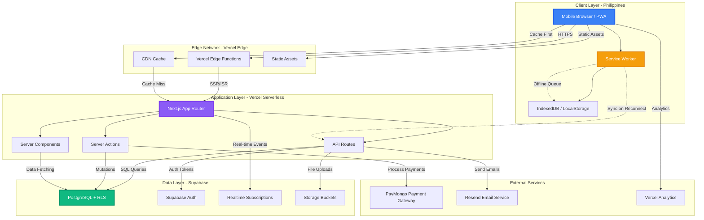
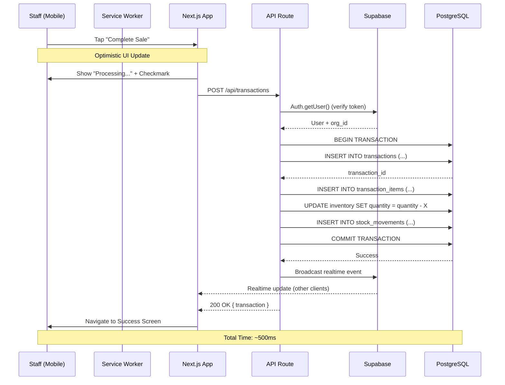

# Architecture Document
## VapeTrack PH - Technical Strategy & System Design

**Version:** 1.0  
**Last Updated:** February 4, 2026  
**Author:** Technical Lead - VapeTrack PH  
**Target Audience:** Development Team, Technical Stakeholders

---

## 📋 Table of Contents
- [Executive Summary](#executive-summary)
- [Stack](stack.md)
- [Project Structure](project_structure.md)
- [Security](security.md)
- [Deployment](deployment.md)
- [Authentication](authentication.md)
- [Payments](payments.md)
- [Development Workflow](workflow.md)
- [Monitoring & Operations](monitoring.md)

---

## Executive Summary

VapeTrack PH is a **Progressive Web App (PWA)** built with a modern, serverless architecture optimized for the **Philippine market**. The system is designed to:

✅ **Operate efficiently on 4G/5G networks** via aggressive caching strategies  
✅ **Scale from day one** using multi-tenant SaaS architecture with row-level security  
✅ **Minimize operational costs** by leveraging free tiers (Vercel, Supabase)  
✅ **Enable solo developer productivity** through type-safe, full-stack TypeScript  
✅ **Deliver sub-second interactions** via edge caching and optimistic UI updates

### Core Architectural Principles

1. **Mobile-First PWA:** Installable, app-like experience with responsive design
2. **Edge-First Rendering:** Static generation + ISR for instant page loads
3. **Database-Driven Security:** Row-level security (RLS) enforces multi-tenancy at the database layer
4. **Optimistic UI:** Assume success, sync in background, handle failures gracefully
5. **Type Safety End-to-End:** TypeScript everywhere, auto-generated DB types from Supabase

---

## High-Level Architecture

### System Architecture Diagram

### Data Flow: Recording a Sale (Happy Path)

