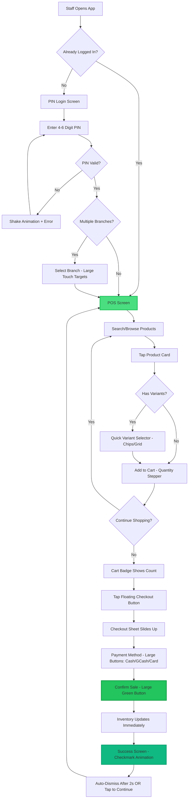
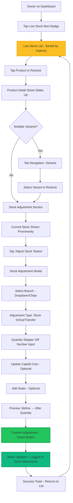
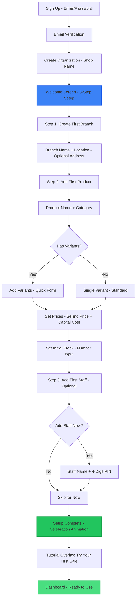
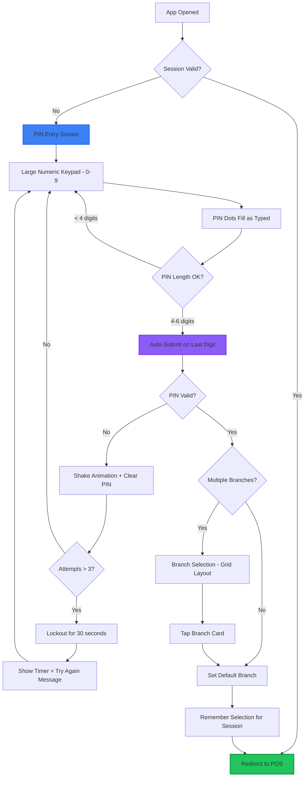

# Core Principles & Flows

## Design Principles

### 1. Speed-First Design
**Primary Goal:** Enable staff to complete a sale in under 30 seconds with one hand.

- **One-Tap Actions:** Most common operations require a single tap
- **Predictive UI:** Anticipate next action based on context
- **Minimal Input:** Reduce typing; use steppers, presets, and quick-select
- **Instant Feedback:** Visual confirmation for every action (haptic feedback where supported)

### 2. Mobile-First, Touch-Optimized
**Target Device:** Android smartphones (5.5" - 6.7" screens)

- **44×44px Minimum Touch Targets:** All interactive elements meet this standard
- **Thumb Zone Optimization:** Critical actions placed within natural thumb reach
- **One-Handed Operation:** Primary navigation and actions accessible with thumb
- **Landscape Support:** Optional for tablet users

### 3. Dark Mode as Default
**Context:** Vape shops often have ambient lighting; reduce eye strain.

- **High Contrast:** Ensure WCAG AAA contrast ratios (7:1+)
- **Dim Surfaces:** Use dark grays, not pure black (reduces OLED burn-in)
- **Color Coding:** Use semantic colors for quick recognition (red = low stock, green = profit)

### 4. Contextual Simplicity
**User Technical Literacy:** Basic to moderate

- **Role-Based UI:** Staff see only what they need (no profit margins, no analytics)
- **Progressive Disclosure:** Advanced features hidden until needed
- **Visual Hierarchy:** Large typography for key info (prices, stock counts)
- **Icon + Label:** Never rely on icons alone

### 5. Network-Aware Design (Future Enhancement)
**Network Reality:** Philippine internet can be unreliable

_Note: Offline capabilities planned for Phase 2_

- **Optimistic UI:** Assume success, sync in background
- **Clear Error Handling:** Informative messages when requests fail
- **Network Status Indicators:** Visual feedback for connection issues

---

## High-Level Site Map

### 🏪 Shop Owner Navigation Structure

```
VapeTrack PH (Owner)
│
├── 📊 Dashboard (Home)
│   ├── Today's Sales Summary
│   ├── Quick Stats (Revenue, Profit, Transactions)
│   ├── Low Stock Alerts
│   ├── Top Sellers (This Week)
│   └── Recent Activity Feed
│
├── 💰 POS (Point of Sale)
│   ├── Product Search/Browse
│   ├── Cart Management
│   ├── Checkout Flow
│   └── Transaction History
│
├── 📦 Inventory
│   ├── Product List (Search, Filter by Category/Branch)
│   ├── Add/Edit Product
│   │   ├── Product Details
│   │   └── Variant Management (SKU, Price, Cost, Stock)
│   ├── Stock Adjustment
│   ├── Low Stock Alerts
│   └── Inventory Reports
│
├── 🏢 Branches
│   ├── Branch List
│   ├── Add/Edit Branch
│   └── Branch Performance Comparison
│
├── 👥 Staff Management
│   ├── Staff List
│   ├── Add/Edit Staff (PIN Setup)
│   ├── Staff Performance Reports
│   └── Activity Logs (Audit Trail)
│
├── 📈 Reports & Analytics
│   ├── Sales Reports (Daily/Weekly/Monthly/Yearly)
│   ├── Profit Analysis
│   ├── Product Performance
│   ├── Staff Performance
│   └── Export Data (CSV/Excel)
│
├── ⚙️ Settings
│   ├── Shop Profile
│   ├── Subscription & Billing
│   ├── Preferences (Low Stock Thresholds, Notifications)
│   └── Account Settings (Password, Security)
│
└── 🔐 Authentication
    ├── Owner Login (Email/Password)
    └── Logout
```

### 👤 Staff Navigation Structure (Simplified)

```
VapeTrack PH (Staff)
│
├── 🔐 PIN Login
│   └── Branch Selection
│
├── 💰 POS (Point of Sale) — PRIMARY SCREEN
│   ├── Product Search/Browse
│   ├── Cart Management
│   └── Checkout Flow
│
├── 📦 Quick Inventory Lookup (Read-Only)
│   └── Check Stock Levels
│
└── 👤 Profile
    ├── View My Sales Today
    └── Logout
```

**Navigation Pattern:**
- **Owner:** Bottom Navigation (5 tabs: Dashboard, POS, Inventory, Reports, Settings)
- **Staff:** Floating Action Button (FAB) for primary actions (POS, Quick Inventory), with hidden bottom nav to maximize screen real estate.

---

## Core User Flows

### 1. The "Speed Sale" Flow (Staff)
**Target Time:** < 30 seconds from login to receipt



**Key Optimization Points:**
- **Persistent Login:** Staff stays logged in for 8 hours (configurable)
- **No Page Reload:** SPA navigation, instant transitions
- **Predictive Search:** Search starts on first keystroke, debounced 200ms
- **Smart Defaults:** Last-used payment method pre-selected
- **Haptic Feedback:** Tactile confirmation on add-to-cart, checkout

---

### 2. The "Restock" Flow (Owner)
**Target Time:** < 45 seconds per product



**Key Optimization Points:**
- **Smart Sorting:** Lowest stock first, then by sales velocity
- **Bulk Actions:** Future: Select multiple products, apply same adjustment
- **Barcode Support (Future):** Scan to find product instantly
- **Autosave Capital Cost:** Remember last-entered cost for each supplier

---

### 3. First-Time Setup Flow (Owner)
**Onboarding Goal:** Get first sale completed within 15 minutes



**Key Optimization Points:**
- **Minimal Required Fields:** Name only; address optional
- **Inline Validation:** Real-time feedback on errors
- **Progress Indicator:** Clear "Step 1 of 3" visual
- **Skip Options:** Can skip staff creation, add later
- **Sample Data:** Offer to pre-populate with demo products

---

### 4. Staff PIN Login Flow
**Target Time:** < 5 seconds



**Key Optimization Points:**
- **Auto-Submit:** No "Enter" button needed
- **Biometric Future:** Face unlock on supported devices
- **Remember Branch:** Default to last-selected branch


### Staff Navigation (FAB Pattern)

Instead of the standard bottom navigation bar, staff users get a simplified interface focused on speed:

**Quick Actions FAB (Floating Action Button)**
- **Position:** Fixed bottom-right (24px from edges)
- **Primary Action (POS):** Large circular button (64px), shadow-xl
- **Secondary Action (Inventory):** Smaller circular button (56px) above POS button
- **Behavior:** Always visible on non-POS pages.

**Why this pattern?**
- Maximizes screen real estate for data entry
- Reduces cognitive load (fewer navigation choices)
- Explicit "Speed-First" optimization for the most common task (opening POS)

---
