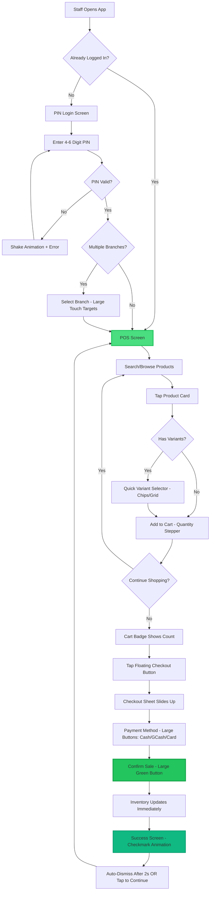
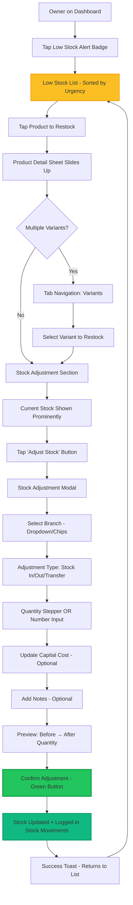
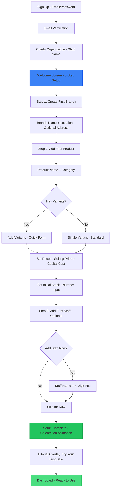
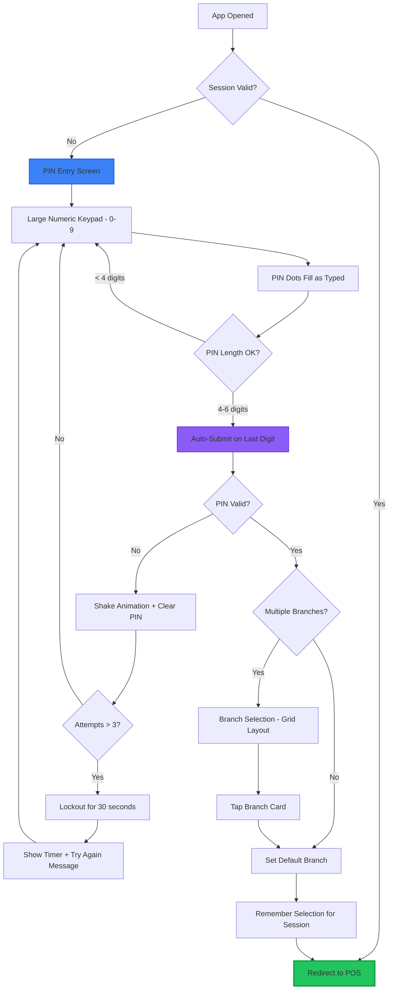

# UI/UX Design Document
## VapeTrack PH - Mobile-First Sales & Inventory Management

**Version:** 1.0  
**Last Updated:** February 4, 2026  
**Design Owner:** VapeTrack PH Design Team  
**Platform:** Progressive Web App (PWA) - Mobile-First

---

## 📋 Table of Contents
- [Design Principles](#design-principles)
- [High-Level Site Map](#high-level-site-map)
- [Core User Flows](#core-user-flows)
- [Wireframe Descriptions](#wireframe-descriptions)
- [Design System](#design-system)
- [Interaction Patterns](#interaction-patterns)
- [Accessibility Guidelines](#accessibility-guidelines)
- [Performance Considerations](#performance-considerations)

---

## Design Principles

### 1. Speed-First Design
**Primary Goal:** Enable staff to complete a sale in under 30 seconds with one hand.

- **One-Tap Actions:** Most common operations require a single tap
- **Predictive UI:** Anticipate next action based on context
- **Minimal Input:** Reduce typing; use steppers, presets, and quick-select
- **Instant Feedback:** Visual confirmation for every action (haptic feedback where supported)

### 2. Mobile-First, Touch-Optimized
**Target Device:** Android smartphones (5.5" - 6.7" screens)

- **44×44px Minimum Touch Targets:** All interactive elements meet this standard
- **Thumb Zone Optimization:** Critical actions placed within natural thumb reach
- **One-Handed Operation:** Primary navigation and actions accessible with thumb
- **Landscape Support:** Optional for tablet users

### 3. Dark Mode as Default
**Context:** Vape shops often have ambient lighting; reduce eye strain.

- **High Contrast:** Ensure WCAG AAA contrast ratios (7:1+)
- **Dim Surfaces:** Use dark grays, not pure black (reduces OLED burn-in)
- **Color Coding:** Use semantic colors for quick recognition (red = low stock, green = profit)

### 4. Contextual Simplicity
**User Technical Literacy:** Basic to moderate

- **Role-Based UI:** Staff see only what they need (no profit margins, no analytics)
- **Progressive Disclosure:** Advanced features hidden until needed
- **Visual Hierarchy:** Large typography for key info (prices, stock counts)
- **Icon + Label:** Never rely on icons alone

### 5. Network-Aware Design (Future Enhancement)
**Network Reality:** Philippine internet can be unreliable

_Note: Offline capabilities planned for Phase 2_

- **Optimistic UI:** Assume success, sync in background
- **Clear Error Handling:** Informative messages when requests fail
- **Network Status Indicators:** Visual feedback for connection issues

---

## High-Level Site Map

### 🏪 Shop Owner Navigation Structure

```
VapeTrack PH (Owner)
│
├── 📊 Dashboard (Home)
│   ├── Today's Sales Summary
│   ├── Quick Stats (Revenue, Profit, Transactions)
│   ├── Low Stock Alerts
│   ├── Top Sellers (This Week)
│   └── Recent Activity Feed
│
├── 💰 POS (Point of Sale)
│   ├── Product Search/Browse
│   ├── Cart Management
│   ├── Checkout Flow
│   └── Transaction History
│
├── 📦 Inventory
│   ├── Product List (Search, Filter by Category/Branch)
│   ├── Add/Edit Product
│   │   ├── Product Details
│   │   └── Variant Management (SKU, Price, Cost, Stock)
│   ├── Stock Adjustment
│   ├── Low Stock Alerts
│   └── Inventory Reports
│
├── 🏢 Branches
│   ├── Branch List
│   ├── Add/Edit Branch
│   └── Branch Performance Comparison
│
├── 👥 Staff Management
│   ├── Staff List
│   ├── Add/Edit Staff (PIN Setup)
│   ├── Staff Performance Reports
│   └── Activity Logs (Audit Trail)
│
├── 📈 Reports & Analytics
│   ├── Sales Reports (Daily/Weekly/Monthly/Yearly)
│   ├── Profit Analysis
│   ├── Product Performance
│   ├── Staff Performance
│   └── Export Data (CSV/Excel)
│
├── ⚙️ Settings
│   ├── Shop Profile
│   ├── Subscription & Billing
│   ├── Preferences (Low Stock Thresholds, Notifications)
│   └── Account Settings (Password, Security)
│
└── 🔐 Authentication
    ├── Owner Login (Email/Password)
    └── Logout
```

### 👤 Staff Navigation Structure (Simplified)

```
VapeTrack PH (Staff)
│
├── 🔐 PIN Login
│   └── Branch Selection
│
├── 💰 POS (Point of Sale) — PRIMARY SCREEN
│   ├── Product Search/Browse
│   ├── Cart Management
│   └── Checkout Flow
│
├── 📦 Quick Inventory Lookup (Read-Only)
│   └── Check Stock Levels
│
└── 👤 Profile
    ├── View My Sales Today
    └── Logout
```

**Navigation Pattern:**
- **Owner:** Bottom Navigation (5 tabs: Dashboard, POS, Inventory, Reports, Settings)
- **Staff:** Single-Screen Focus (POS fullscreen, minimal navigation)

---

## Core User Flows

### 1. The "Speed Sale" Flow (Staff)
**Target Time:** < 30 seconds from login to receipt



**Key Optimization Points:**
- **Persistent Login:** Staff stays logged in for 8 hours (configurable)
- **No Page Reload:** SPA navigation, instant transitions
- **Predictive Search:** Search starts on first keystroke, debounced 200ms
- **Smart Defaults:** Last-used payment method pre-selected
- **Haptic Feedback:** Tactile confirmation on add-to-cart, checkout

---

### 2. The "Restock" Flow (Owner)
**Target Time:** < 45 seconds per product



**Key Optimization Points:**
- **Smart Sorting:** Lowest stock first, then by sales velocity
- **Bulk Actions:** Future: Select multiple products, apply same adjustment
- **Barcode Support (Future):** Scan to find product instantly
- **Autosave Capital Cost:** Remember last-entered cost for each supplier

---

### 3. First-Time Setup Flow (Owner)
**Onboarding Goal:** Get first sale completed within 15 minutes



**Key Optimization Points:**
- **Minimal Required Fields:** Name only; address optional
- **Inline Validation:** Real-time feedback on errors
- **Progress Indicator:** Clear "Step 1 of 3" visual
- **Skip Options:** Can skip staff creation, add later
- **Sample Data:** Offer to pre-populate with demo products

---

### 4. Staff PIN Login Flow
**Target Time:** < 5 seconds



**Key Optimization Points:**
- **Auto-Submit:** No "Enter" button needed
- **Biometric Future:** Face unlock on supported devices
- **Remember Branch:** Default to last-selected branch

---

## Wireframe Descriptions

### 1. POS Screen (Staff Primary View)
**Device:** Mobile (375×812px reference - iPhone X/11/12/13 Mini size)  
**Orientation:** Portrait (Primary), Landscape (Optional)

#### Layout Structure

```
┌─────────────────────────────────────┐
│  ☰  VapeTrack PH        [Cart: 3] 🛒│ ← Header (60px)
├─────────────────────────────────────┤
│  🔍 Search products...              │ ← Search Bar (56px)
├─────────────────────────────────────┤
│  [Juice] [Devices] [Pods] [Cotton] │ ← Category Chips (48px, horizontal scroll)
├─────────────────────────────────────┤
│                                     │
│  ┌────────┐  ┌────────┐            │
│  │ [IMG]  │  │ [IMG]  │            │ ← Product Grid
│  │ Mango  │  │ Mint   │            │   (2 columns, gap: 12px)
│  │ Juice  │  │ Juice  │            │
│  │ ₱450   │  │ ₱450   │            │   Card Size: 
│  └────────┘  └────────┘            │   164×200px
│                                     │
│  ┌────────┐  ┌────────┐            │
│  │ [IMG]  │  │ [IMG]  │            │
│  │ Vape   │  │ Cotton │            │
│  │ Device │  │ Bacon  │            │
│  │ ₱2,500 │  │ ₱150   │            │
│  └────────┘  └────────┘            │
│                                     │
│  [Load More...]                     │
│                                     │
│                                     │ ← Scrollable Area
│                                     │
│                                     │
└─────────────────────────────────────┘
│         [💰 Checkout (3)]          │ ← Floating Action Button (64px)
└─────────────────────────────────────┘
```

#### Component Details

**Header Bar (Sticky)**
- **Height:** 60px
- **Background:** `surface-dark` (#1f2937)
- **Left:** Hamburger menu (44×44px) → Drawer: Profile, Logout
- **Center:** "VapeTrack PH" logo/text (16px, semibold)
- **Right:** Cart badge (44×44px) with item count bubble

**Search Bar**
- **Height:** 56px
- **Padding:** 16px horizontal
- **Icon:** Magnifying glass (20px) left-aligned
- **Placeholder:** "Search products..." (14px, gray-400)
- **Behavior:** Focus → expand to full width, show recent searches

**Category Chips (Horizontal Scroll)**
- **Height:** 48px (including 8px top/bottom padding)
- **Chip Size:** Auto-width, 36px height, 16px padding
- **Style:** Outlined (inactive), filled primary (active)
- **Behavior:** Tap to filter products by category

**Product Cards (Grid)**
- **Layout:** 2 columns, 12px gap
- **Card Size:** 164×200px
- **Structure:**
  - Product Image (164×120px, aspect 4:3, lazy load)
  - Product Name (14px, semibold, 2-line truncate)
  - Price (18px, bold, primary color)
  - Stock Indicator (Future): Small badge if low stock
- **Interaction:** Tap card → Variant selector OR Add to cart

**Floating Checkout Button**
- **Position:** Fixed bottom, 16px from edges
- **Size:** Full-width minus 32px (343×64px on 375px screen)
- **Style:** Large, rounded (16px radius), primary green gradient
- **Text:** "💰 Checkout (3)" — 18px, bold, white
- **Behavior:** 
  - Tap → Slide up cart sheet
  - Badge shows item count
  - Pulse animation when item added

---

### 2. Variant Selector Modal (Appears after tapping product with variants)

```
┌─────────────────────────────────────┐
│                 ╳                   │ ← Drag Handle + Close
├─────────────────────────────────────┤
│  [Product Image - 120px height]     │
│                                     │
│  Premium Vape Juice - Mango         │ ← Product Name (18px, bold)
│  ₱450 • In Stock: 23 bottles        │ ← Meta Info (14px, gray)
├─────────────────────────────────────┤
│  Select Nicotine Level:             │ ← Section Label (14px, gray-400)
│                                     │
│  ┌─────┐ ┌─────┐ ┌─────┐ ┌─────┐  │
│  │ 0mg │ │ 3mg │ │ 6mg │ │12mg │  │ ← Variant Chips (Grid)
│  └─────┘ └─────┘ └─────┘ └─────┘  │   Each: 72×56px
│           [SELECTED - Primary]      │
│                                     │
├─────────────────────────────────────┤
│  Quantity:                          │
│                                     │
│  ┌───┐  ┌─────┐  ┌───┐             │
│  │ - │  │  1  │  │ + │             │ ← Quantity Stepper
│  └───┘  └─────┘  └───┘             │   Each button: 56×56px
│   (48×48px touch target)            │
│                                     │
├─────────────────────────────────────┤
│  Subtotal: ₱450                     │ ← Price Preview (16px)
│                                     │
│  [ Add to Cart ]                    │ ← CTA Button (Full-width, 56px)
└─────────────────────────────────────┘
```

#### Interaction Details

**Sheet Behavior:**
- Slides up from bottom (iOS-style modal)
- Semi-transparent backdrop (black, 40% opacity)
- Swipe down to dismiss OR tap outside OR tap ✕

**Variant Selection:**
- **Layout:** Horizontal chips if ≤ 4 variants, Grid if > 4
- **Active State:** Primary color fill, white text, subtle shadow
- **Inactive State:** Outlined, gray text
- **Out of Stock:** Grayed out, strikethrough, disabled

**Quantity Stepper:**
- **Default:** 1
- **Min:** 1
- **Max:** Current stock quantity
- **Increment:** +1 per tap
- **Long Press (Future):** +5 or +10

**Add to Cart Button:**
- **State:** Disabled if variant not selected
- **Haptic:** Light vibration on tap
- **Animation:** Checkmark bounce, then dismiss modal

---

### 3. Checkout Cart Sheet

```
┌─────────────────────────────────────┐
│           Your Cart (3)         ╳   │ ← Header
├─────────────────────────────────────┤
│                                     │
│  ┌─ Mango Juice (3mg) ──────────┐  │
│  │ Qty: 2    ₱450 × 2 = ₱900   │  │ ← Line Item
│  │                     [−] [+] │  │   (Swipe left to delete)
│  └─────────────────────────────┘  │
│                                     │
│  ┌─ Cotton Bacon ───────────────┐  │
│  │ Qty: 1    ₱150 × 1 = ₱150   │  │
│  └─────────────────────────────┘  │
│                                     │
│  ┌─ Vape Device (Black) ────────┐  │
│  │ Qty: 1    ₱2,500 × 1 = ₱2,500│  │
│  └─────────────────────────────┘  │
│                                     │
├─────────────────────────────────────┤
│  Subtotal:              ₱3,550      │ ← Summary (Bold, 18px)
│                                     │
├─────────────────────────────────────┤
│  Payment Method:                    │
│                                     │
│  ┌─────┐ ┌─────┐ ┌─────┐           │
│  │ 💵  │ │ 📱  │ │ 💳  │           │ ← Payment Buttons
│  │Cash │ │GCash│ │Card │           │   Each: 96×80px
│  └─────┘ └─────┘ └─────┘           │   (Active: Primary fill)
│   [SELECTED]                        │
│                                     │
├─────────────────────────────────────┤
│  Customer Name (Optional)           │
│  [________________________]         │ ← Text Input (48px)
│                                     │
├─────────────────────────────────────┤
│  [ Complete Sale - ₱3,550 ]         │ ← Final CTA (64px, Green)
└─────────────────────────────────────┘
```

#### Interaction Details

**Line Items:**
- **Layout:** List, 8px gap
- **Actions:** 
  - Tap quantity stepper to adjust
  - Swipe left → Delete icon appears
  - Tap delete → Confirm toast

**Payment Method:**
- **Layout:** Horizontal grid, 3 columns
- **Icons:** Emoji + label (14px)
- **Selection:** Single-choice, primary fill on active
- **Default:** Last-used method OR Cash

**Complete Sale Button:**
- **State:** Disabled if cart empty OR payment method not selected
- **Loading:** Spinner animation during API call
- **Success:** Navigate to success screen

---

### 4. Dashboard (Owner View)
**Goal:** At-a-glance business health, above the fold on mobile

```
┌─────────────────────────────────────┐
│  ☰  Dashboard          🔔 [3]      │ ← Header (Notification badge)
├─────────────────────────────────────┤
│  Good morning, Juan! ☀️             │ ← Personalized Greeting (18px)
│  Branch: Manila (Main) ▼            │ ← Branch Selector (Tap to switch)
├─────────────────────────────────────┤
│  TODAY'S SALES                      │ ← Section Header (12px, gray-400, uppercase)
│                                     │
│  ┌───────────────────────────────┐ │
│  │  ₱12,450                      │ │ ← Sales Card (Large)
│  │  Total Revenue                │ │   BG: Gradient (Green)
│  │                               │ │   Height: 120px
│  │  📈 +15% vs yesterday         │ │   Profit shown for owners only
│  │  Profit: ₱4,230 (34%)         │ │
│  └───────────────────────────────┘ │
│                                     │
├─────────────────────────────────────┤
│  QUICK STATS                        │
│                                     │
│  ┌──────────┐  ┌──────────┐        │
│  │ 42       │  │ ₱296     │        │ ← Stat Cards (2 cols)
│  │ Sales    │  │ Avg Sale │        │   Each: ~164×100px
│  └──────────┘  └──────────┘        │
│                                     │
├─────────────────────────────────────┤
│  ⚠️ LOW STOCK ALERTS (3)            │ ← Alert Section (Yellow accent)
│                                     │
│  • Mango Juice (3mg) - 5 left      │
│  • Cotton Bacon - 3 left           │ ← Tappable list items
│  • Pod System - 8 left             │   (→ Navigate to product)
│                                     │
│  [View All Low Stock →]            │
│                                     │
├─────────────────────────────────────┤
│  🔥 TOP SELLERS (This Week)         │
│                                     │
│  1. Mango Juice (3mg)    45 sold   │
│  2. Vape Device (Black)  12 sold   │ ← Numbered list
│  3. Cotton Bacon         38 sold   │   (Product name + quantity)
│                                     │
├─────────────────────────────────────┤
│  📝 RECENT ACTIVITY                 │
│                                     │
│  • Maria sold ₱450 - 2m ago        │
│  • Juan restocked Mint Juice - 1h  │ ← Activity feed
│  • New staff added: Pedro - 3h    │   (Icon + text + time)
│                                     │
│  [View All Activity →]             │
│                                     │
└─────────────────────────────────────┘
│  [Dashboard] [POS] [Inv] [Rpt] [⚙️] │ ← Bottom Navigation (60px)
└─────────────────────────────────────┘
```

#### Component Details

**Branch Selector:**
- **Style:** Pill button, outlined, dropdown icon
- **Interaction:** Tap → Modal with branch list (large touch targets)
- **Effect:** Filters all dashboard data by selected branch

**Sales Card (Hero):**
- **Height:** 120px
- **Background:** Gradient (green-500 to green-600)
- **Layout:** Vertical stack
  - Revenue (32px, bold, white)
  - Label (14px, white 80% opacity)
  - Trend indicator (14px, icon + text)
  - Profit (16px, only for owners)

**Quick Stats Grid:**
- **Layout:** 2 columns, 12px gap
- **Card Height:** 100px
- **Style:** Dark surface, rounded (12px), subtle border
- **Content:** Number (24px, bold) + Label (12px, gray)

**Low Stock Alerts:**
- **Header:** Yellow warning icon, item count badge
- **List:** Max 3 items shown, "View All" expands
- **Item Style:** Bullet + product name + stock count (red text)
- **Interaction:** Tap item → Navigate to product detail

**Top Sellers:**
- **List:** Numbered, max 3 shown
- **Style:** Rank number (bold, primary) + name + count (gray)

**Recent Activity Feed:**
- **List:** Icon + text + relative time
- **Icons:** Contextual (💰 sale, 📦 restock, 👤 user action)
- **Limit:** 3 items, "View All" for full feed

---

### 5. Product Form (Add/Edit Product)
**Challenge:** Handle variants efficiently on mobile

```
┌─────────────────────────────────────┐
│  ← Back    Add Product       Save  │ ← Header
├─────────────────────────────────────┤
│                                     │
│  [📷 Upload Image]                  │ ← Image Upload (120×120px, centered)
│  Tap to add photo                   │
│                                     │
├─────────────────────────────────────┤
│  Product Information                │ ← Section (Accordion-style)
│                                     │
│  Product Name *                     │
│  [_____________________________]    │ ← Text Input (48px height)
│                                     │
│  Category                           │
│  [Select category ▼___________]    │ ← Dropdown (48px)
│                                     │
│  Brand                              │
│  [_____________________________]    │
│                                     │
│  Description                        │
│  [_____________________________]    │ ← Textarea (96px)
│  [_____________________________]    │
│                                     │
├─────────────────────────────────────┤
│  Variants                           │
│                                     │
│  ○ Single Product (No Variants)     │ ← Radio Options
│  ● Has Variants (e.g., 3mg, 6mg)    │   (Large touch targets)
│                                     │
│  ┌─ Variant 1 ──────────────────┐  │
│  │ Variant Name: [3mg_______]   │  │ ← Variant Card
│  │ SKU: [PVJ-MANGO-3MG______]   │  │   (Collapsible)
│  │ Selling Price: [₱ 450____]   │  │
│  │ Capital Cost: [₱ 320_____]   │  │
│  │ Initial Stock: [10_______]   │  │
│  │               [− Remove]     │  │
│  └──────────────────────────────┘  │
│                                     │
│  ┌─ Variant 2 ──────────────────┐  │
│  │ Variant Name: [6mg_______]   │  │
│  │ ... (collapsed)              │  │
│  └──────────────────────────────┘  │
│                                     │
│  [+ Add Another Variant]            │ ← Button (Outlined, 48px)
│                                     │
├─────────────────────────────────────┤
│  Stock Alert Settings               │
│                                     │
│  Low Stock Threshold                │
│  ┌───┐  ┌─────┐  ┌───┐             │
│  │ - │  │ 10  │  │ + │             │ ← Number Stepper
│  └───┘  └─────┘  └───┘             │
│                                     │
├─────────────────────────────────────┤
│  [ Save Product ]                   │ ← CTA (Full-width, 56px, Green)
└─────────────────────────────────────┘
```

#### Interaction Details

**Variant Toggle:**
- **Single Product:** Creates ONE variant named "Standard" (hidden from user)
- **Has Variants:** Shows variant form fields

**Variant Management:**
- **Add Variant:** Expands new card with empty fields
- **Remove Variant:** Requires confirmation if stock exists
- **Collapse/Expand:** Tap header to toggle card visibility

**Smart Defaults:**
- **SKU:** Auto-generated from Product Name + Variant Name (editable)
- **Stock:** Default 0, can set later
- **Capital Cost:** Optional at creation, required for profit tracking

**Validation:**
- **Required Fields:** Product name, variant name, selling price
- **Price Validation:** Selling price ≥ capital cost (warning if not)
- **Inline Errors:** Red text below field, prevents save

---

### 6. Inventory List (Owner)

```
┌─────────────────────────────────────┐
│  ← Back    Inventory       [+]     │ ← Header (+ to add product)
├─────────────────────────────────────┤
│  🔍 Search by name or SKU...        │ ← Search Bar
│                                     │
│  [All] [Juice] [Devices] [Pods]    │ ← Filter Chips (Horizontal scroll)
│                                     │
│  Branch: Manila ▼  |  Sort: A-Z ▼  │ ← Filters (2 cols)
├─────────────────────────────────────┤
│  PRODUCTS (47)                      │ ← Section Header
│                                     │
│  ┌─────────────────────────────────┐│
│  │ [IMG] Premium Vape Juice - Man...││ ← Product Row (Expandable)
│  │       Juice • Brand XYZ        ││   Tap to expand variants
│  │       4 variants • 38 in stock ││
│  │                            [>] ││
│  └─────────────────────────────────┘│
│    ↓ EXPANDED STATE:                │
│  ┌─────────────────────────────────┐│
│  │ [IMG] Premium Vape Juice - Man...││
│  │                                 ││
│  │ ├─ 0mg  (SKU: ...3MG) ─────────┤││
│  │ │  Stock: 10  |  ₱450  [Edit] │││ ← Variant Rows
│  │ └────────────────────────────────┘│   (Scrollable if many)
│  │ ├─ 3mg  (SKU: ...3MG) ─────────┤││
│  │ │  Stock: 5   |  ₱450  [Edit] │││   Stock shown if owner
│  │ └────────────────────────────────┘│
│  │ ├─ 6mg  (SKU: ...6MG) ─────────┤││
│  │ │  Stock: 8   |  ₱450  [Edit] │││
│  │ └────────────────────────────────┘│
│  │ ├─ 12mg (SKU: ...12MG) ────────┤││
│  │ │  Stock: 15  |  ₱500  [Edit] │││
│  │ └────────────────────────────────┘│
│  │                            [^] ││ ← Collapse
│  └─────────────────────────────────┘│
│                                     │
│  ┌─────────────────────────────────┐│
│  │ [IMG] Cotton Bacon             ││
│  │       Cotton • Brand ABC       ││
│  │       1 variant • 23 in stock  ││
│  │                            [>] ││
│  └─────────────────────────────────┘│
│                                     │
│  ┌─────────────────────────────────┐│
│  │ [IMG] Vape Device Pro          ││
│  │       Device • Brand XYZ  ⚠️ LOW││ ← Low Stock Badge
│  │       3 variants • 8 in stock  ││
│  │                            [>] ││
│  └─────────────────────────────────┘│
│                                     │
└─────────────────────────────────────┘
```

#### Component Details

**Product Row (Collapsed):**
- **Height:** 80px
- **Layout:** Horizontal flex
  - Image (60×60px, rounded)
  - Text Stack (Product name, meta info)
  - Expand chevron (24×24px)
- **Meta Info:** Category • Brand • Variant count • Total stock
- **Badge:** Low stock warning (yellow/red)

**Variant Rows (Expanded):**
- **Indented:** 16px left padding, nested appearance
- **Layout:** SKU + Stock count + Price + Edit button (icon)
- **Edit Action:** Navigate to edit variant sheet

**Stock Visibility:**
- **Owner:** See all stock levels and prices
- **Staff:** No access to inventory list (read-only lookup only)

---

### 7. Staff PIN Login

```
┌─────────────────────────────────────┐
│                                     │
│                                     │
│         VapeTrack PH 🌿             │ ← Logo (Centered, 48px)
│                                     │
│                                     │
│      Enter Your PIN                 │ ← Instruction (18px, gray)
│                                     │
│      ●  ●  ●  ●  ○  ○              │ ← PIN Dots (4 filled, 2 empty)
│                                     │   Shows 4-6 digit progress
│                                     │
│                                     │
│   ┌───────────────────────┐        │
│   │  1     2     3        │        │
│   │                       │        │ ← Numeric Keypad
│   │  4     5     6        │        │   Each button: 96×96px
│   │                       │        │   Large, touch-optimized
│   │  7     8     9        │        │
│   │                       │        │
│   │  ←     0     ✓        │        │   ← = Backspace
│   └───────────────────────┘        │   ✓ = Submit (if 4-6 digits)
│                                     │
│                                     │
│   Forgot PIN? Contact Admin         │ ← Help Text (14px, link)
│                                     │
│                                     │
└─────────────────────────────────────┘
```

#### Interaction Details

**PIN Entry:**
- **Auto-Submit:** When 4-6 digits entered, validates immediately
- **Backspace:** Clear last digit
- **Submit (✓):** Only enabled when PIN length valid
- **Success:** Immediate redirect to branch selection OR POS
- **Error:** Shake animation, clear PIN, red flash on dots

**Security:**
- **Rate Limiting:** 3 failed attempts → 30-second lockout
- **Lockout Screen:** Timer countdown, "Try again in XX seconds"
- **No Hints:** Don't reveal PIN length on error

---

### 8. Reports Screen (Owner)

```
┌─────────────────────────────────────┐
│  ← Back    Reports                  │
├─────────────────────────────────────┤
│  📅 Date Range                      │
│                                     │
│  [Today ▼]                          │ ← Preset Dropdown (48px)
│     • Today                         │   Options: Today, Yesterday,
│     • Yesterday                     │   This Week, Last Week,
│     • This Week                     │   This Month, Last Month,
│     • Last Week                     │   This Year, Custom
│     • This Month                    │
│     • Custom...                     │
│                                     │
│  Branch: [All Branches ▼]          │
├─────────────────────────────────────┤
│  SALES SUMMARY                      │
│                                     │
│  ┌─────────────────────────────────┐│
│  │ Total Revenue       ₱125,430   │││
│  │ Total Capital Cost   ₱82,150   │││ ← Summary Cards
│  │ Gross Profit         ₱43,280   │││   (Stacked, 60px each)
│  │ Profit Margin          34.4%   │││
│  └─────────────────────────────────┘│
│                                     │
├─────────────────────────────────────┤
│  📊 SALES CHART                     │
│                                     │
│  [Chart visualization here]         │ ← Line/Bar Chart (200px height)
│   Revenue over time                 │   Future: react-charts or recharts
│                                     │
├─────────────────────────────────────┤
│  🔥 TOP PRODUCTS                    │
│                                     │
│  1. Mango Juice (3mg)               │
│     145 sold • ₱65,250 revenue     │ ← Ranked list with metrics
│                                     │
│  2. Vape Device Pro (Black)         │
│     38 sold • ₱95,000 revenue      │
│                                     │
│  3. Cotton Bacon                    │
│     92 sold • ₱13,800 revenue      │
│                                     │
│  [View Full Report →]              │
│                                     │
├─────────────────────────────────────┤
│  👥 STAFF PERFORMANCE               │
│                                     │
│  Maria Santos                       │
│  52 sales • ₱42,300 revenue        │
│                                     │
│  Juan Dela Cruz                     │
│  38 sales • ₱31,200 revenue        │
│                                     │
│  [View Detailed Breakdown →]       │
│                                     │
├─────────────────────────────────────┤
│  [ 📥 Export Report (CSV) ]         │ ← Export Button (Full-width, 56px)
└─────────────────────────────────────┘
```

#### Component Details

**Date Range Picker:**
- **Presets:** Common ranges (Today, This Week, etc.)
- **Custom:** Opens calendar modal (date range selector)
- **Default:** Today

**Summary Cards:**
- **Layout:** Stacked vertically, 60px each
- **Style:** Dark surface, left-aligned label, right-aligned value
- **Emphasis:** Profit values in green/red based on positive/negative

**Charts (Future):**
- **Library:** Chart.js or Recharts (React-friendly)
- **Type:** Line chart for trends, Bar chart for comparisons
- **Responsive:** Touch-enabled, zoomable on mobile

**Export:**
- **Format:** CSV (Excel-compatible)
- **Content:** Full dataset for selected date range
- **Behavior:** Download file OR email (future)

---

## Design System

### Color Palette

#### Dark Mode (Default)

**Surface Colors:**
```css
--surface-app: #0f172a        /* App background (Slate 950) */
--surface-card: #1e293b       /* Card backgrounds (Slate 800) */
--surface-elevated: #334155   /* Modals, dropdowns (Slate 700) */
--surface-hover: #475569      /* Hover states (Slate 600) */
```

**Primary (Brand):**
```css
--primary-50: #f0fdf4         /* Lightest tint */
--primary-100: #dcfce7
--primary-500: #22c55e        /* Main brand color (Green 500) */
--primary-600: #16a34a        /* Hover state */
--primary-700: #15803d        /* Active state */
--primary-900: #14532d        /* Darkest shade */
```

**Semantic Colors:**
```css
/* Success (Same as Primary) */
--success: #22c55e
--success-bg: #166534

/* Error / Low Stock Critical */
--error: #ef4444             /* Red 500 */
--error-bg: #7f1d1d          /* Red 950 */

/* Warning / Low Stock */
--warning: #f59e0b           /* Amber 500 */
--warning-bg: #78350f        /* Amber 950 */

/* Info */
--info: #3b82f6              /* Blue 500 */
--info-bg: #1e3a8a           /* Blue 950 */

/* Profit Green (Accent) */
--profit: #10b981            /* Emerald 500 */

/* Loss/Cost Red */
--loss: #f87171              /* Red 400 */
```

**Text Colors:**
```css
--text-primary: #f8fafc      /* White text (Slate 50) */
--text-secondary: #cbd5e1    /* Gray text (Slate 300) */
--text-muted: #94a3b8        /* Muted text (Slate 400) */
--text-disabled: #64748b     /* Disabled text (Slate 500) */
```

**Border Colors:**
```css
--border-default: #334155    /* Subtle borders (Slate 700) */
--border-strong: #475569     /* Emphasized borders (Slate 600) */
--border-interactive: #22c55e /* Interactive elements (Primary) */
```

---

### Typography

**Font Family:**
```css
/* Primary: Excellent readability on small screens */
--font-sans: 'Inter', -apple-system, BlinkMacSystemFont, 'Segoe UI', sans-serif;

/* Monospace (for SKUs, numbers): */
--font-mono: 'JetBrains Mono', 'Courier New', monospace;
```

**Google Fonts Import:**
```html
<link rel="preconnect" href="https://fonts.googleapis.com">
<link href="https://fonts.googleapis.com/css2?family=Inter:wght@400;500;600;700;800&display=swap" rel="stylesheet">
```

**Font Sizes (Mobile-First):**
```css
--text-xs: 12px      /* Small labels, meta info */
--text-sm: 14px      /* Body text, descriptions */
--text-base: 16px    /* Default body text */
--text-lg: 18px      /* Section headers, emphasized text */
--text-xl: 20px      /* Page titles */
--text-2xl: 24px     /* Large numbers (stats) */
--text-3xl: 30px     /* Hero numbers (revenue) */
--text-4xl: 36px     /* Rare, major emphasis */
```

**Font Weights:**
```css
--font-normal: 400
--font-medium: 500   /* Subtle emphasis */
--font-semibold: 600 /* Buttons, labels */
--font-bold: 700     /* Numbers, prices */
--font-extrabold: 800 /* Hero text */
```

**Line Heights:**
```css
--leading-tight: 1.25   /* Headings */
--leading-normal: 1.5   /* Body text */
--leading-relaxed: 1.75 /* Long-form content */
```

---

### Spacing Scale (8px Base)

```css
--space-1: 4px      /* 0.25rem - Tight spacing */
--space-2: 8px      /* 0.5rem - Base unit */
--space-3: 12px     /* 0.75rem - Card gaps */
--space-4: 16px     /* 1rem - Standard padding */
--space-5: 20px     /* 1.25rem */
--space-6: 24px     /* 1.5rem - Section spacing */
--space-8: 32px     /* 2rem - Large gaps */
--space-10: 40px    /* 2.5rem */
--space-12: 48px    /* 3rem - Major sections */
--space-16: 64px    /* 4rem - Hero spacing */
```

**Component Padding:**
- **Cards:** 16px (--space-4)
- **Buttons:** 12px horizontal, 16px vertical (--space-3, --space-4)
- **Modals:** 24px (--space-6)
- **Page Edges:** 16px (--space-4)

---

### Border Radius

```css
--radius-sm: 6px     /* Small elements (badges, chips) */
--radius-md: 8px     /* Default (buttons, inputs) */
--radius-lg: 12px    /* Cards */
--radius-xl: 16px    /* Large modals, sheets */
--radius-2xl: 24px   /* Hero cards */
--radius-full: 9999px /* Pills, avatars */
```

---

### Shadows (Dark Mode Optimized)

```css
/* Subtle elevation for dark surfaces */
--shadow-sm: 0 1px 2px 0 rgba(0, 0, 0, 0.3);

/* Cards */
--shadow-md: 0 4px 6px -1px rgba(0, 0, 0, 0.4),
             0 2px 4px -1px rgba(0, 0, 0, 0.3);

/* Modals, floating buttons */
--shadow-lg: 0 10px 15px -3px rgba(0, 0, 0, 0.5),
             0 4px 6px -2px rgba(0, 0, 0, 0.3);

/* Emphasized (CTAs) */
--shadow-xl: 0 20px 25px -5px rgba(0, 0, 0, 0.6),
             0 10px 10px -5px rgba(0, 0, 0, 0.4);

/* Colored shadows for primary buttons */
--shadow-primary: 0 8px 16px -4px rgba(34, 197, 94, 0.3);
```

---

### UI Components Library

#### 1. Buttons

**Primary Button (CTA):**
```css
.btn-primary {
  background: linear-gradient(135deg, var(--primary-600), var(--primary-500));
  color: white;
  padding: 16px 24px;
  border-radius: var(--radius-md);
  font-weight: var(--font-semibold);
  font-size: var(--text-base);
  box-shadow: var(--shadow-primary);
  
  /* Touch target */
  min-height: 56px;
  min-width: 56px;
  
  /* Interaction */
  transition: all 0.2s ease;
}

.btn-primary:hover {
  background: var(--primary-700);
  box-shadow: var(--shadow-lg);
}

.btn-primary:active {
  transform: scale(0.98);
}
```

**Secondary Button (Outlined):**
```css
.btn-secondary {
  background: transparent;
  color: var(--primary-500);
  border: 2px solid var(--primary-500);
  padding: 14px 22px; /* Adjusted for border */
  border-radius: var(--radius-md);
  font-weight: var(--font-semibold);
  min-height: 56px;
}
```

**Danger Button:**
```css
.btn-danger {
  background: var(--error);
  color: white;
  /* Same structure as primary */
}
```

**Icon Button (Small):**
```css
.btn-icon {
  width: 44px;
  height: 44px;
  border-radius: var(--radius-full);
  display: flex;
  align-items: center;
  justify-content: center;
  background: var(--surface-elevated);
  color: var(--text-primary);
}
```

---

#### 2. Input Fields

**Text Input:**
```css
.input-text {
  background: var(--surface-elevated);
  color: var(--text-primary);
  border: 2px solid var(--border-default);
  padding: 14px 16px;
  border-radius: var(--radius-md);
  font-size: var(--text-base);
  min-height: 48px;
  width: 100%;
  
  /* Transition */
  transition: border-color 0.2s ease;
}

.input-text:focus {
  outline: none;
  border-color: var(--primary-500);
  box-shadow: 0 0 0 3px rgba(34, 197, 94, 0.1);
}

.input-text::placeholder {
  color: var(--text-muted);
}

.input-text.error {
  border-color: var(--error);
}
```

**Number Input (Stepper):**
```css
.input-stepper {
  display: flex;
  align-items: center;
  gap: 12px;
}

.input-stepper button {
  width: 48px;
  height: 48px;
  border-radius: var(--radius-md);
  background: var(--surface-elevated);
  color: var(--text-primary);
  font-size: 20px;
  font-weight: bold;
}

.input-stepper input {
  width: 80px;
  text-align: center;
  font-size: var(--text-xl);
  font-weight: var(--font-bold);
  background: var(--surface-card);
  border: 2px solid var(--border-default);
  border-radius: var(--radius-md);
  padding: 12px;
}
```

---

#### 3. Cards

**Product Card (Grid):**
```css
.product-card {
  background: var(--surface-card);
  border-radius: var(--radius-lg);
  overflow: hidden;
  box-shadow: var(--shadow-md);
  transition: transform 0.2s ease, box-shadow 0.2s ease;
}

.product-card:active {
  transform: scale(0.98);
  box-shadow: var(--shadow-sm);
}

.product-card-image {
  width: 100%;
  height: 120px;
  object-fit: cover;
  background: var(--surface-elevated);
}

.product-card-content {
  padding: 12px;
}

.product-card-title {
  font-size: var(--text-sm);
  font-weight: var(--font-semibold);
  color: var(--text-primary);
  line-height: var(--leading-tight);
  
  /* Truncate to 2 lines */
  display: -webkit-box;
  -webkit-line-clamp: 2;
  -webkit-box-orient: vertical;
  overflow: hidden;
}

.product-card-price {
  font-size: var(--text-lg);
  font-weight: var(--font-bold);
  color: var(--primary-500);
  margin-top: 4px;
}
```

**Stat Card (Dashboard):**
```css
.stat-card {
  background: var(--surface-card);
  border: 1px solid var(--border-default);
  border-radius: var(--radius-lg);
  padding: 20px;
  display: flex;
  flex-direction: column;
  gap: 8px;
}

.stat-card-value {
  font-size: var(--text-2xl);
  font-weight: var(--font-bold);
  color: var(--text-primary);
}

.stat-card-label {
  font-size: var(--text-sm);
  font-weight: var(--font-medium);
  color: var(--text-secondary);
  text-transform: uppercase;
  letter-spacing: 0.05em;
}
```

---

#### 4. Badges & Chips

**Badge (Notification Count):**
```css
.badge {
  background: var(--error);
  color: white;
  font-size: var(--text-xs);
  font-weight: var(--font-bold);
  padding: 2px 6px;
  border-radius: var(--radius-full);
  min-width: 20px;
  height: 20px;
  display: inline-flex;
  align-items: center;
  justify-content: center;
}
```

**Category Chip (Filter):**
```css
.chip {
  background: var(--surface-elevated);
  color: var(--text-secondary);
  border: 2px solid var(--border-default);
  padding: 8px 16px;
  border-radius: var(--radius-full);
  font-size: var(--text-sm);
  font-weight: var(--font-medium);
  white-space: nowrap;
  transition: all 0.2s ease;
}

.chip.active {
  background: var(--primary-600);
  color: white;
  border-color: var(--primary-600);
}
```

**Status Badge (Low Stock):**
```css
.badge-warning {
  background: var(--warning-bg);
  color: var(--warning);
  border: 1px solid var(--warning);
  padding: 4px 8px;
  border-radius: var(--radius-sm);
  font-size: var(--text-xs);
  font-weight: var(--font-semibold);
  text-transform: uppercase;
}
```

---

#### 5. Bottom Sheet / Modal

**Bottom Sheet (Mobile):**
```css
.bottom-sheet {
  position: fixed;
  bottom: 0;
  left: 0;
  right: 0;
  background: var(--surface-card);
  border-radius: var(--radius-xl) var(--radius-xl) 0 0;
  box-shadow: var(--shadow-xl);
  max-height: 85vh;
  overflow-y: auto;
  padding: 24px;
  z-index: 1000;
  
  /* Slide-up animation */
  transform: translateY(100%);
  transition: transform 0.3s ease-out;
}

.bottom-sheet.open {
  transform: translateY(0);
}

.bottom-sheet-handle {
  width: 40px;
  height: 4px;
  background: var(--border-strong);
  border-radius: var(--radius-full);
  margin: 0 auto 16px;
}
```

**Backdrop:**
```css
.backdrop {
  position: fixed;
  inset: 0;
  background: rgba(0, 0, 0, 0.6);
  z-index: 999;
  backdrop-filter: blur(2px);
  opacity: 0;
  transition: opacity 0.3s ease;
}

.backdrop.visible {
  opacity: 1;
}
```

---

#### 6. Bottom Navigation (Owner)

```css
.bottom-nav {
  position: fixed;
  bottom: 0;
  left: 0;
  right: 0;
  height: 60px;
  background: var(--surface-card);
  border-top: 1px solid var(--border-default);
  display: flex;
  justify-content: space-around;
  align-items: center;
  padding: 0 8px;
  z-index: 100;
}

.bottom-nav-item {
  flex: 1;
  display: flex;
  flex-direction: column;
  align-items: center;
  gap: 4px;
  padding: 8px;
  color: var(--text-muted);
  font-size: var(--text-xs);
  font-weight: var(--font-medium);
  transition: color 0.2s ease;
  
  /* Touch target */
  min-width: 48px;
  min-height: 48px;
}

.bottom-nav-item.active {
  color: var(--primary-500);
}

.bottom-nav-item svg {
  width: 24px;
  height: 24px;
}
```

---

#### 7. Floating Action Button (FAB)

```css
.fab {
  position: fixed;
  bottom: 80px; /* Above bottom nav */
  right: 16px;
  width: 64px;
  height: 64px;
  border-radius: var(--radius-full);
  background: linear-gradient(135deg, var(--primary-600), var(--primary-500));
  color: white;
  box-shadow: var(--shadow-primary);
  display: flex;
  align-items: center;
  justify-content: center;
  font-size: 28px;
  z-index: 50;
  transition: all 0.2s ease;
}

.fab:active {
  transform: scale(0.95);
}
```

---

#### 8. Toast Notifications

```css
.toast {
  position: fixed;
  bottom: 80px;
  left: 16px;
  right: 16px;
  background: var(--surface-elevated);
  color: var(--text-primary);
  padding: 16px;
  border-radius: var(--radius-md);
  box-shadow: var(--shadow-lg);
  display: flex;
  align-items: center;
  gap: 12px;
  font-size: var(--text-sm);
  z-index: 1001;
  
  /* Slide-up animation */
  animation: toast-slide-up 0.3s ease-out;
}

@keyframes toast-slide-up {
  from {
    transform: translateY(100%);
    opacity: 0;
  }
  to {
    transform: translateY(0);
    opacity: 1;
  }
}

.toast.success {
  border-left: 4px solid var(--success);
}

.toast.error {
  border-left: 4px solid var(--error);
}

.toast.warning {
  border-left: 4px solid var(--warning);
}
```

---

#### 9. Loading States

**Spinner:**
```css
.spinner {
  border: 3px solid var(--surface-elevated);
  border-top-color: var(--primary-500);
  border-radius: var(--radius-full);
  width: 24px;
  height: 24px;
  animation: spin 0.8s linear infinite;
}

@keyframes spin {
  to { transform: rotate(360deg); }
}
```

**Skeleton Loader (Product Card):**
```css
.skeleton {
  background: linear-gradient(
    90deg,
    var(--surface-card) 0%,
    var(--surface-elevated) 50%,
    var(--surface-card) 100%
  );
  background-size: 200% 100%;
  animation: skeleton-loading 1.5s ease-in-out infinite;
  border-radius: var(--radius-md);
}

@keyframes skeleton-loading {
  0% { background-position: 200% 0; }
  100% { background-position: -200% 0; }
}
```

---

#### 10. Empty States

```css
.empty-state {
  display: flex;
  flex-direction: column;
  align-items: center;
  justify-content: center;
  padding: 48px 24px;
  text-align: center;
}

.empty-state-icon {
  font-size: 64px;
  color: var(--text-muted);
  margin-bottom: 16px;
}

.empty-state-title {
  font-size: var(--text-lg);
  font-weight: var(--font-semibold);
  color: var(--text-primary);
  margin-bottom: 8px;
}

.empty-state-description {
  font-size: var(--text-sm);
  color: var(--text-secondary);
  margin-bottom: 24px;
}
```

---

## Interaction Patterns

### Touch Gestures

**Swipe Gestures:**
- **Swipe Left on Cart Item:** Reveal delete button
- **Swipe Down on Bottom Sheet:** Dismiss modal
- **Swipe Left/Right on Image Gallery:** Navigate product images (future)

**Long Press:**
- **Long Press on Product Card:** Quick actions menu (Edit, Delete, Duplicate)
- **Long Press on Quantity Stepper:** Fast increment/decrement (+10)

**Pull to Refresh:**
- **Pull Down on Dashboard:** Refresh data
- **Pull Down on Inventory List:** Reload products

---

### Loading & Feedback

**Optimistic UI:**
- **Add to Cart:** Immediate visual feedback, sync in background
- **Stock Adjustment:** Update UI instantly, rollback on error

**Loading States:**
- **Initial Load:** Full-screen skeleton loader
- **Infinite Scroll:** Spinner at bottom of list
- **Button Loading:** Spinner replaces button text, disable interaction

**Success Feedback:**
- **Sale Completed:** Green checkmark animation + haptic + toast
- **Product Added:** Toast notification "Product added successfully"

**Error Handling:**
- **API Error:** Red toast with error message + "Retry" button
- **Validation Error:** Inline error text below field, red border
- **Network Error:** Toast notification with retry option

---

### Navigation Patterns

**Tab Navigation (Owner):**
- Persistent bottom navigation (5 tabs)
- Active tab highlighted (primary color)
- Badge on tabs (e.g., notification count)

**Stack Navigation (Modals):**
- Bottom sheets for forms (Add Product, Checkout)
- Slide up from bottom, swipe down to dismiss
- Backdrop darkens background

**Breadcrumbs (Complex Flows):**
- "← Back" button top-left on detail pages
- Clear navigation hierarchy

---

## Accessibility Guidelines

### WCAG 2.1 Level AA Compliance

**Color Contrast:**
- **Text on Background:** Minimum 7:1 (AAA level for dark mode)
- **Large Text (18px+):** Minimum 4.5:1
- **Interactive Elements:** Minimum 3:1 contrast with adjacent colors

**Touch Targets:**
- **Minimum Size:** 44×44px (Apple), 48×48px (Android Material)
- **Spacing:** 8px minimum gap between interactive elements

**Focus States:**
- **Keyboard Navigation:** Visible focus ring (3px outline, primary color)
- **Focus Order:** Logical tab order (top to bottom, left to right)

**Screen Reader Support:**
- **ARIA Labels:** All icons have accessible labels
- **Semantic HTML:** Proper heading hierarchy (h1, h2, h3)
- **Alt Text:** All images have descriptive alt attributes

**Motion & Animations:**
- **Respect `prefers-reduced-motion`:** Disable animations if user prefers
- **Optional:** Toggle in settings to disable all animations

---

## Performance Considerations

### Mobile Optimization

**Image Optimization:**
- **Format:** WebP with JPEG fallback
- **Lazy Loading:** Intersection Observer for below-fold images
- **Responsive Images:** `srcset` for different screen densities (1x, 2x, 3x)
- **Size:** Max 200KB per product image, compressed

**Code Splitting:**
- **Route-based:** Load dashboard, POS, inventory separately
- **Component-based:** Lazy load charts, modals on demand

**Caching:**
- **Service Worker:** Cache static assets (CSS, JS, fonts)
- **API Caching:** Cache product list, refresh every 5 minutes
- **Local Storage:** Session persistence (cart state, auth tokens)

**Bundle Size:**
- **Target:** < 200KB gzipped for initial load
- **Tree Shaking:** Remove unused code from libraries
- **Font Loading:** Subset Google Fonts (Latin only), preload critical fonts

---

### Performance Budgets

| Metric | Target | Critical |
|--------|--------|----------|
| **First Contentful Paint (FCP)** | < 1.5s | < 2.5s |
| **Largest Contentful Paint (LCP)** | < 2.0s | < 3.0s |
| **Time to Interactive (TTI)** | < 3.0s | < 4.5s |
| **Cumulative Layout Shift (CLS)** | < 0.1 | < 0.25 |
| **First Input Delay (FID)** | < 100ms | < 300ms |

**Testing Conditions:**
- **Network:** 3G Fast (1.6 Mbps down, 750 Kbps up, 150ms RTT)
- **Device:** Mid-range Android (4GB RAM, Snapdragon 660)

---

## Responsive Breakpoints

```css
/* Mobile First - Default styles for 320px+ */

/* Small phones (landscape) */
@media (min-width: 480px) {
  /* Adjust font sizes, spacing slightly */
}

/* Tablets (portrait) */
@media (min-width: 768px) {
  /* 3-column product grid */
  /* Side-by-side layouts (cart + checkout) */
}

/* Tablets (landscape) / Small laptops */
@media (min-width: 1024px) {
  /* 4-column product grid */
  /* Sidebar navigation (replace bottom nav) */
  /* Split-screen POS (products left, cart right) */
}

/* Desktops */
@media (min-width: 1280px) {
  /* Max width container (1200px) */
  /* Multi-column dashboard */
}
```

**Breakpoint Variables:**
```css
--breakpoint-sm: 480px
--breakpoint-md: 768px
--breakpoint-lg: 1024px
--breakpoint-xl: 1280px
```

---

## Animation & Transitions

### Timing Functions

```css
--ease-out: cubic-bezier(0.33, 1, 0.68, 1);     /* Fast start, slow end */
--ease-in-out: cubic-bezier(0.65, 0, 0.35, 1);  /* Smooth both ends */
--bounce: cubic-bezier(0.68, -0.55, 0.27, 1.55); /* Subtle bounce */
```

### Common Animations

**Fade In:**
```css
@keyframes fade-in {
  from { opacity: 0; }
  to { opacity: 1; }
}
```

**Slide Up:**
```css
@keyframes slide-up {
  from {
    transform: translateY(100%);
    opacity: 0;
  }
  to {
    transform: translateY(0);
    opacity: 1;
  }
}
```

**Scale Pulse (Add to Cart):**
```css
@keyframes scale-pulse {
  0%, 100% { transform: scale(1); }
  50% { transform: scale(1.05); }
}
```

**Shake (Error):**
```css
@keyframes shake {
  0%, 100% { transform: translateX(0); }
  25% { transform: translateX(-10px); }
  75% { transform: translateX(10px); }
}
```

---

## Icon System

**Recommended Icon Library:**
- **Lucide Icons:** Lightweight, consistent, React-friendly
- **Alternative:** Heroicons (Tailwind's official icons)

**Icon Sizes:**
```css
--icon-xs: 16px   /* Inline with text */
--icon-sm: 20px   /* Buttons, chips */
--icon-md: 24px   /* Default */
--icon-lg: 32px   /* Headers, emphasis */
--icon-xl: 48px   /* Empty states, heroes */
```

**Common Icons Needed:**
- **POS:** ShoppingCart, CreditCard, Banknote, Smartphone, CheckCircle
- **Inventory:** Package, Box, TrendingUp, TrendingDown, AlertTriangle
- **Navigation:** Home, BarChart3, Users, Settings, LogOut
- **Actions:** Plus, Minus, Trash2, Edit, Search, Filter, X
- **Status:** Check, AlertCircle, Info, ChevronRight, ChevronDown

---

## Future Enhancements

### Progressive Web App (PWA)

**Phase 1 - Basic PWA:**
- Add to Home Screen prompt (iOS, Android)
- App icon, splash screen
- Standalone mode (no browser chrome)
- Static asset caching

**Phase 2 - Offline-First Capabilities:**
- Advanced Service Worker strategies
- IndexedDB for transaction queue
- Background sync for failed requests
- Conflict resolution for offline edits

**Push Notifications:**
- Low stock alerts
- Daily sales summary
- Staff shift reminders

---

### Advanced Features (Post-MVP)

**Barcode Scanner:**
- Camera-based scanning (QuaggaJS or Scandit)
- Quick product lookup by barcode

**Voice Input:**
- "Add 3 Mango Juice to cart" (Web Speech API)
- Hands-free operation for busy staff

**Biometric Auth:**
- Face unlock (WebAuthn API)
- Fingerprint login on supported devices

**Dark/Light Mode Toggle:**
- User preference setting
- Automatic based on system preference

**Multi-Language:**
- English (default)
- Filipino/Tagalog
- Localized number formats, currency

---

## Design Handoff Checklist

### For Developers

- [ ] **Design Tokens:** CSS variables documented in codebase
- [ ] **Component Library:** Storybook or similar for component catalog
- [ ] **Figma/Sketch File:** High-fidelity mockups linked in README
- [ ] **Iconography:** Icon library installed, usage guide
- [ ] **Responsive Specs:** Breakpoints defined, mobile-first approach
- [ ] **Animation Specs:** Duration, easing, trigger conditions
- [ ] **Accessibility:** ARIA labels, focus states, screen reader testing
- [ ] **Performance:** Image optimization, lazy loading, code splitting

### For QA

- [ ] **Touch Target Testing:** All interactive elements ≥ 44×44px
- [ ] **Contrast Testing:** WCAG AA/AAA compliance verified
- [ ] **Responsive Testing:** Test on real devices (Android 5.5"-6.7")
- [ ] **Performance Testing:** Lighthouse scores meet targets
- [ ] **Gesture Testing:** Swipe, long-press, pull-to-refresh work correctly
- [ ] **Error State Testing:** All error messages clear, actionable

---

## Appendix

### Design Resources

**Tools:**
- **Design:** Figma (collaborative design)
- **Prototyping:** Framer, ProtoPie (interactive prototypes)
- **Icons:** Lucide Icons (https://lucide.dev)
- **Fonts:** Google Fonts (Inter)
- **Color Palette:** Tailwind CSS Colors (https://tailwindcss.com/docs/customizing-colors)

**Inspiration:**
- **Mobile POS:** Square POS, Shopify POS
- **Dashboard:** Linear, Notion (clean, fast UIs)
- **Dark Mode:** Stripe Dashboard, GitHub

**User Testing:**
- **Tools:** UserTesting.com, Maze.co
- **Target:** 5-10 vape shop staff in Philippines
- **Goals:** Validate "Speed Sale" flow, identify friction points

---

**Document Version:** 1.0  
**Last Updated:** February 4, 2026  
**Design Owner:** VapeTrack PH Design Team  

**Next Steps:**
1. Review with development team (feasibility check)
2. Create high-fidelity Figma mockups for key screens
3. Build interactive prototype for user testing
4. Conduct usability testing with target users
5. Iterate based on feedback
6. Finalize design system and component library

---

**References:**
- [PRD.md](./PRD.md) - Product requirements
- [SCHEMA.md](./SCHEMA.md) - Database schema
- [Material Design (Mobile)](https://m3.material.io) - Android design guidelines
- [iOS Human Interface Guidelines](https://developer.apple.com/design/human-interface-guidelines/) - iOS best practices
- [WCAG 2.1](https://www.w3.org/WAI/WCAG21/quickref/) - Accessibility standards
